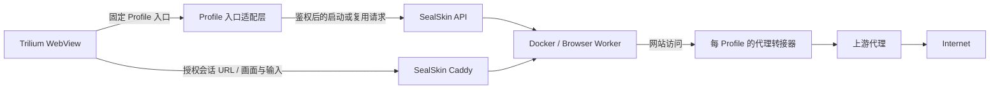

> 历史快照：归档于 2026-09-13。正文完整保留整理前的内容（仅调整相对链接），混有不同时期的方案与进度；其中“当前”“下一步”和未完成项均属于当时记录。现行信息见 [文档导航](../README.md)、[开发进度](../progress.md) 和 [开发计划](../roadmap.md)。

# TriliumNext Browser Profile Service

## 开发背景、架构设计与实施计划

**文档版本：** v1.3（实施规格与 Camoufox 阶段验收）
**基准日期：** 2026-09-12
**目标平台：** Linux / Debian 13
**项目性质：** Self-hosted Browser Profile Service
**主要入口：** TriliumNext Desktop Web View

**当前实施决策（2026-09-12）：** 优先验证 SealSkin + 小型 Profile 入口适配层，验证通过后复用其容器生命周期、会话认证和 Caddy 数据通道；独立 Broker + Docker 是适配成本过高时的备选方案。此决策不表示 SealSkin 已通过本项目验收。

**当前 PoC 实测状态（2026-09-12）：** 入口适配层运行于 `127.0.0.1:9100`；`https://mybrowser.azhen.de` 提供 `/browser/*` 与 `/bootstrap/*`，`https://mysession.azhen.de` 提供 SealSkin Session、API、WebSocket 和 `/room`。SealSkin 8443 使用包含 `mysession.azhen.de` SAN 的内部 CA 叶子证书，前置 Caddy 通过 `/etc/caddy/sealskin-ca/ca.pem` 校验上游。Personal/Work 两个 Firefox Worker、命名 Home、会话复用和并发幂等已通过启动级验收。Personal 已配置独立 Relay sidecar、`internal` Profile 网络和锁定 SOCKS5/远端 DNS 的 Firefox 镜像；SealSkin 创建的 cleanroom Worker 只接该内网，经 Relay 返回 200，直接 HTTPS 被阻断。Relay 停止和上游 egress 断开时没有回退直连，容器直接 IPv4/IPv6 与公网 DNS 也被阻断。现有 Personal Session 仍使用切换前的普通 Worker，配置在下次新建 Session 时生效。随机 DNS 权威日志、浏览器 IPv6/WebRTC/STUN、跨 Profile 和重启窗口尚未完成第 48.5 节全套验收，因此当前运行栈仍是 PoC。

**2026-09-13 更新：** 当前控制服务发布为 `0.3.2-network-v2-e13c19eedc38245d`。受管理启动先保存占用，分配独立网络、Relay 与 Guard；Guard 安装默认拒绝规则并降权后才探测和启动 Worker，修复了 v1 中同网段管理端口可达的问题。122 项 Python 测试、Go/race/vet、18 项真实 Docker 生命周期场景、11 项 Firefox 网络检查及真实 Personal 上游验证通过。控制容器重建保持真实 Firefox 原进程并接回显示网络；独立 Docker daemon 的恢复也有范围明确的证据。现有 Work/Personal 原 Session 与全部关键进程保留，`personal-socks5-r2` 下次新建 Personal 会话生效。正式 Docker/VPS 重启、公开 DNS 轮换和成功 HTTP/3 等尚未验收。见 [网络隔离与恢复记录](../../infra/sealskin/network-isolation-acceptance-2026-09-13.md)。

CA 私钥只保存在被忽略的 `infra/sealskin/secrets/sealskin-ca.key`（`0600`），不进入 SealSkin 容器、Docker 环境变量、Firefox Home 或文档。静态 Relay 的代理凭据保存在同一被忽略目录的独立 `0600` 文件；动态策略凭据使用 SealSkin 私有配置目录下 `network-secrets/` 中的不可变版本文件（目录 `0700`、文件 `0600`）。凭据以只读方式挂载给各自 Relay，不进入 Worker、镜像、环境变量或文档。主机文件挂载仍需在生产阶段替换为 tmpfs/Docker Secret 或外部 Secret Store。

**阅读顺序：** 第 4、6、7、13、14、40、44 节为当前职责与路线；第 45–50 节为代理、浏览器环境、网络与密钥的实施规格。其他章节保留原始需求及独立 Broker 的方案参考，其中的 Broker/Docker/SQLite 实现步骤不应直接叠加到 SealSkin 上。存在冲突时，以以上当前章节为准。

**配套文件：** [SealSkin Profile Adapter](../../adapter/README.md) 已实现入口控制面和应用热配置命令；[Profile Relay](../../relay/README.md) 已实现固定 SOCKS5 上游、可选用户名/密码认证、远端域名转发和无直连回退；[Personal 网络 overlay](../../infra/sealskin/compose.proxy.yml) 与 [Firefox Proxy Worker](../../infra/firefox-proxy/README.md) 实现当前 sidecar PoC；[SealSkin 0.3.2 适配审计](../sealskin-0.3.2-audit.md) 记录复用边界和上游缺口；[Go 数据契约](../specs/proxy-environment/types.go)、[SQLite 建库规格](../specs/proxy-environment/schema.sql)、[配置示例](../specs/proxy-environment/config.example.json)、[健康报告示例](../specs/proxy-environment/health.example.json) 是代理/环境阶段的开发输入。

Personal 当前绑定 `env-tw-firefox-baseline-r1`：`zh-TW`、`Asia/Taipei`、1920×1080、DPR 1、WebRTC disabled。镜像在 `/init` 前验证环境 JSON 摘要和启动设置；错误或漂移会停止 Worker。该产物是原生 Firefox 基线，不包含 Camoufox 低层指纹。固定版本 Wayland 页面只能观测到 1280×720，因此 Personal 暂时固定 X11；恢复 Wayland 前必须让页面观测通过同一屏幕产物。

Camoufox 已固定 Python 0.5.6、BrowserForge 1.2.4 和浏览器 v152.0.4-beta.30，发布独立 `env-tw-camoufox-r4` 产物与 `camoufox-personal-r4` SealSkin 应用。17 项产物测试、11 类启动拒绝、两个 QA Home 各 10 次删除重建和离线恢复通过；Canvas、字体、音频、WebGL、语音及语言/屏幕逐字段保持一致。正式 X11/Selkies Worker 也通过正常入口与只读产物/报告检查，outer 1600×900、inner 1600×844。当前未切换既有 Personal/Work 入口，真实 Home 没有迁移；客户端及生产矩阵的范围见 [Camoufox 验收记录](../../infra/camoufox/acceptance-2026-09-12.md)。Adapter 已由 systemd 用户服务托管，主机尚未允许启用 linger，开机/退出登录持久运行仍待验证。

---

# 1. 项目背景

TriliumNext 是一个非常适合作为个人知识管理中心的软件，它拥有：

* 树状 Note 结构
* Attribute / Relation
* Script / Widget
* REST API
* Dashboard
* Web View
* 自托管能力
* 可编程扩展能力

截至本文编写时，TriliumNext 最新稳定版为 **v0.105.0，发布于 2026-08-19**。

TriliumNext Desktop 的 Web View 使用 Electron WebView，而不是普通浏览器 iframe，因此相比 Web 版可以嵌入更多网站。官方文档同时确认，自 v0.104.0 起，Web View 还能嵌入 Dashboard、Canvas 和 Text Note。

但是 TriliumNext 当前 Web View 仍然存在几个明显限制：

1. Web View 更像“嵌入网页”，而不是完整浏览器。
2. 缺少完整浏览器导航体验。
3. 多个 Web View 默认共享 Web View Session。
4. 没有原生 Browser Profile 管理。
5. 没有 Per-Profile Proxy。
6. 没有 Browser Fingerprint Profile。
7. 如果大量 Web View 都直接承担浏览任务，Trilium Electron 本身会逐渐承担过多职责。

从 v0.104.0 开始，TriliumNext 已经把 Web View 放到独立的 `persist:webview` Electron Session，并增加了 WebView attach 检查和 deny-by-default 权限策略，因此 Web View 与 Trilium 自身 Cookie 已经有明确安全边界。

因此，本项目不准备把 TriliumNext 修改成一个完整浏览器。

更合理的做法是：

> **让 TriliumNext 成为 Browser Profile Service 的知识库、入口和控制台，而真正的浏览器运行在 Linux Server 上。**

---

# 2. 项目目标

构建一个完全自托管的 Browser Profile Service。

用户在 TriliumNext 中可以建立：

```text
🌐 Browser Profiles
├── Personal
├── Work
├── ChatGPT-A
├── ChatGPT-B
├── Google-A
├── Google-B
├── GitHub
├── Test-US
├── Test-HK
└── Test-JP
```

每一个 Note 对应一个固定地址：

```text
https://browser.example.com/browser/personal/
https://browser.example.com/browser/work/
https://browser.example.com/browser/chatgpt-a/
```

点击 Note 后：

```text
Trilium WebView
        ↓
Browser Broker
        ↓
检查 Profile Session
        ↓
不存在则创建 Browser Worker
        ↓
挂载 Persistent Profile
        ↓
加载 Proxy
        ↓
加载 Browser Environment
        ↓
启动远程浏览器
        ↓
Selkies Stream
        ↓
显示在 Trilium WebView
```

关闭或长时间不用：

```text
Idle Timeout
     ↓
Browser graceful shutdown
     ↓
Worker 删除
```

但：

```text
Cookies
LocalStorage
IndexedDB
浏览器设置
Proxy Mapping
Profile Configuration
```

全部保留。

---

# 3. 项目核心原则

整个项目必须遵守以下设计原则。

## 3.1 Trilium 不是浏览器运行时

Trilium 只负责：

```text
知识管理
入口
Profile Metadata
Dashboard
Start / Stop / Restart
Status 展示
```

不负责：

```text
Browser Process
Cookies
Proxy Password
Fingerprint Runtime
Docker
Selkies Session
```

---

## 3.2 Container 是临时的

```text
Browser Worker
=
Ephemeral
```

允许：

```text
创建
停止
删除
重新创建
Crash
升级
```

都不影响 Browser Profile。

---

## 3.3 Profile 是永久的

```text
Browser Profile
=
Persistent
```

Profile 包含：

```text
登录状态
Cookie
LocalStorage
IndexedDB
浏览器 Preferences
Proxy Mapping
Browser Engine
Environment Profile
```

---

## 3.4 一个 Profile 同一时间最多一个 Browser Process

禁止：

```text
Camoufox A ─┐
             ├→ /profiles/personal
Camoufox B ─┘
```

否则可能损坏浏览器内部 SQLite 数据。

必须实现：

```text
Profile Lock
```

---

## 3.5 Proxy 与浏览器环境绑定

例如：

```text
personal-us
│
├── Proxy: US
├── Timezone: America/New_York
├── Locale: en-US
└── Region: US
```

不应该出现明显冲突的配置。

---

## 3.6 指纹/环境配置必须稳定

不采用：

```text
每次启动重新随机
```

而采用：

```text
Profile A
   ↓
Environment Profile A
   ↓
长期保持
```

主要用于：

* 自有账号隔离
* 多环境 QA
* 隐私隔离
* 浏览器兼容性测试

本项目不以绕过网站封禁、反滥用机制或访问限制为设计目标。

---

# 4. 当前总体架构

优先验证 SealSkin 作为唯一容器会话管理者。Profile 入口适配层维护业务配置和固定入口，浏览器画面直接通过 SealSkin 自带 Caddy 传输。



DIRECT Profile 按显式网络策略访问 Internet。管理/显示流量与浏览器网站流量分别制定访问规则，详见第 48 节。

PoC 必须验证无扩展启动、命名 Home、Profile 单实例、授权重连、网络限制及空闲回收。不能满足且必须长期修改 SealSkin 核心时，再选择独立 Broker + Docker。两条路径共享第 45–50 节的数据契约和验收，不同时拥有同一批 Worker 的启停权。

---

# 5. 组件选择

## 5.1 操作系统

生产环境：

```text
Debian 13
```

开发代码可以在：

```text
macOS
Windows
Linux
```

编写。

但所有真正联调必须在 Linux 环境完成。

原因包括：

```text
Docker Networking
nftables
Selkies
Wayland
Camoufox
Caddy
Container Isolation
Egress Policy
```

Camoufox 官方构建系统本身也明确以 Linux 为主要构建环境。

---

# 6. Profile 入口适配层与 Browser Broker

当前已建立验证用的最小入口，正式实现范围仍由 SealSkin PoC 决定。代码、配置和运行边界见 [adapter/README.md](../../adapter/README.md)。

入口适配层使用 Go 标准库实现 SealSkin 加密客户端、固定入口、跨进程状态日志和保守恢复；这不要求为了复用数据结构就实现原计划中的完整 Broker。若选择独立 Docker 后端，再扩展为 Go Broker。

已确定需要自有的能力：固定 Profile 标识、配置与修订、网络/环境策略、启动前条件校验、健康结果展示、Trilium 接入。

可以复用的能力：容器创建与停止、会话认证、流量转发、原生会话记录。复用的具体行为必须通过验收，不能仅按功能名称认定满足需求。

---

# 7. 职责与状态所有权

| 数据或行为 | SealSkin 优先方案中的所有者 |
| --- | --- |
| Profile 标识、Proxy/Environment/NetworkPolicy 修订 | 入口适配层 |
| 固定入口、入口授权、启动前策略校验 | 入口适配层 |
| 容器实际生命周期、原生 Session 状态 | SealSkin |
| 会话 Cookie、流媒体反向代理 | SealSkin / 自带 Caddy |
| 浏览器数据、运行期间目录锁、实际环境应用 | Worker |
| 上游代理认证 | 每 Profile 的代理转接器 |
| 网络规则安装与实际出站约束 | 受信任的网络执行组件；PoC 确定实现方式 |
| 健康观测与告警汇总 | 入口适配层，使用 Worker/网络执行组件的证据 |

入口适配层保存 `profile → external_session_id` 的绑定与启动占用，不复制一套完整的 SealSkin Session 状态机。由于 SealSkin 0.3.2 的用户会话列表不返回 `home_name`，当前实现为每次启动持久化唯一 bootstrap URL，并用 `launch_context` 对账。重启恢复先与实际运行状态核对；不确定时记录 `unknown`、保留占用并拒绝重复启动。网络组件只获得实现网络策略所需权限，不应演变为第二个不受约束的 Docker 编排服务。

---

# 8. Selkies

Selkies负责：

> **把 Linux GUI 应用流式传输到 HTML5 Web 页面。**

当前 Selkies 支持：

* Linux Desktop / Single Application
* HTML5 Client
* WebSocket
* 可选 WebRTC
* Clipboard
* Keyboard
* Mouse
* Microphone
* Webcam forwarding
* GPU / CPU Rendering

默认可以完全使用 CPU，不要求 GPU。

因此：

```text
Camoufox / Chromium
        ↓
Linux Wayland
        ↓
Selkies
        ↓
Browser
        ↓
Trilium WebView
```

是本项目的显示层。

LinuxServer 的开发文档也明确支持基于：

```text
ghcr.io/linuxserver/baseimage-selkies
```

构建自定义 GUI Application Image，并以 Chromium 作为官方单应用案例之一。

---

# 9. Browser Worker

Browser Worker 必须设计成一个标准化容器。

第一版：

```text
browser-worker-chromium
```

后期：

```text
browser-worker-camoufox
```

Worker 接口保持一致。

Worker 内部：

```text
┌─────────────────────┐
│ Browser Worker      │
│                     │
│ Selkies             │
│ Wayland             │
│ Browser Engine      │
│ Profile Volume      │
│ Proxy Config        │
│ Environment Config  │
└─────────────────────┘
```

---

# 10. Browser Engine 接口

Broker 不应该知道浏览器内部细节。

定义逻辑接口：

```text
BrowserEngine
│
├── ChromiumEngine
├── CamoufoxEngine
└── FutureEngine
```

Profile：

```text
engine=chromium
```

或者：

```text
engine=camoufox
```

将来替换 Engine 不影响：

```text
Trilium
Broker
Session Lifecycle
Profile Storage
Proxy Registry
```

---

# 11. Camoufox

高级 Environment Profile 阶段使用 Camoufox。

Camoufox 当前提供引擎级环境修改，包括：

* navigator 属性
* OS / Device
* hardware
* Screen / Viewport
* Geolocation
* Timezone
* Locale
* WebRTC IP
* WebGL
* Fonts

其核心区别在于许多修改发生在 Firefox/C++ 实现层，而不是简单 JavaScript 注入。

因此第一版不要自己写：

```javascript
Object.defineProperty(navigator, ...)
```

一类浏览器 Hook。

---

# 12. Persona Studio 的定位

Persona Studio 可以作为后期：

```text
Profile Manager
Environment Profile Manager
Proxy Manager
Health Checker
```

当前 Persona Studio 已经支持：

* Persistent Session
* Per-profile Proxy
* Coherent Profile
* Camoufox
* Patchright
* Playwright
* Web Dashboard
* CLI
* Cookie import/export
* Proxy tester
* WebRTC leak check
* TLS/JA3 checker
* Encrypted secrets

但是它仍属于较新的项目。

因此：

> **Persona Studio 不作为 Browser Broker 的核心依赖。**

Broker 必须能够在没有 Persona 的情况下独立运行。

Persona 是可选管理层。

---

# 13. SealSkin 的定位与选型门槛

SealSkin 是首选验证对象，当前尚未确定为最终生产依赖。

官方架构说明包括命名持久化 Home、加密且带签名的启动 API、启动请求去重、一次性访问 URL、会话 Cookie 和 Caddy 转发。服务器提供的 Web UI 仍通过客户端桥接完成签名和加密；直接打开 `/ui/` 不等于无扩展客户端已经可用。[SealSkin 架构](https://selkies-project.github.io/sealskin/architecture)

必须记录所测发行版和镜像摘要，完成以下 PoC：

| 门槛 | 通过标准 |
| --- | --- |
| 无扩展入口 | Trilium 内完成入口授权、启动及首次消费会话授权 URL |
| 独立存储 | Personal/Work 使用不同命名 Home，删除重建仍恢复各自数据 |
| 单实例 | 20 个同 Profile 请求只产生一个浏览器实例；超时重试与服务重启也成立 |
| 重连 | 固定入口能重新获得当前会话访问权，不永久保存一次性 token |
| 网络与凭证 | 第 45、48、50 节策略能通过受控配置或扩展点实现 |
| 生命周期 | 能获取停止/退出证据并实现约定的空闲回收策略 |

固定笔记入口允许重定向到当次 Session URL，不要求所有静态资源永久驻留在 `/browser/{id}/` 路径。适配层接管用户私钥签名时，必须明确它成为受信任客户端，密钥放入 Secret Store，不能继续声称私钥只存在于终端用户设备。

若 Profile 独占、网络规则或恢复必须大幅修改 SealSkin 核心，记录差距和维护成本后选择独立 Broker；不预先承诺从 Docker 后端迁移到 SealSkin。

---

# 14. 后端适配契约

以下是完整目标的内部逻辑契约，不是 SealSkin 原生 API。当前 Go 适配层已实现其中的启动/复用、访问地址获取和部分恢复语义；可靠 Stop 与托管 Worker 全量对账仍待上游能力或扩展点：

```text
EnsureRuntime(operationID, profileRevision, launchSpec)
InspectRuntime(externalSessionID)
AcquireAccess(externalSessionID, authenticatedPrincipal)
StopRuntime(externalSessionID, shutdownDeadline)
ReconcileManagedRuntimes()
```

`launchSpec` 包含不可变配置引用、逻辑 Home、网络策略、环境产物和资源上限，禁止任意宿主机路径、镜像或 Docker 原始参数从公开 API 直传。

`operationID` 在外部调用之前持久化，同一 Profile 的重试复用同一操作。原生 API 的请求去重不能替代跨客户端、跨认证会话和崩溃恢复后的 Profile 目录独占。无法确认上一次创建是否完成时，先核对运行实例，不重新创建。

`StopRuntime` 的成功必须表示浏览器已退出、占用已释放；超时表示结果未知，不表示可以安全复用目录。切换后端之前必须停止旧后端管理的实例并核对持久化目录。

---

# 15. Persistent Storage

生产目录：

```text
/srv/browser-platform/

├── profiles/
│   ├── personal/
│   ├── work/
│   ├── chatgpt-a/
│   └── ...
│
├── broker/
│   └── browser.db
│
├── fingerprints/
│
├── secrets/
│
├── backups/
│
└── logs/
```

权限：

```text
root/browser-service
0700
```

---

# 16. 数据模型

第一版使用：

```text
SQLite + WAL
```

没有必要一开始部署 PostgreSQL。

---

## 16.1 profiles

```text
profiles

id
name
engine
persistent_home
proxy_id
environment_id
start_url
idle_timeout_seconds
auto_start
enabled
created_at
updated_at
```

例如：

```text
id:
personal-us

engine:
camoufox

persistent_home:
/srv/browser-platform/profiles/personal-us

proxy_id:
proxy-us-01

environment_id:
env-us-desktop-01

start_url:
https://example.com

idle_timeout_seconds:
900
```

---

## 16.2 proxies

```text
proxies

id
name
type
host
port
username_secret_ref
password_secret_ref
region
enabled
created_at
updated_at
```

支持：

```text
direct
http
https
socks5
```

---

## 16.3 environments

```text
environments

id
name
engine
config_json
config_hash
created_at
updated_at
```

保存：

```text
browser/device profile
locale
timezone
screen
hardware parameters
```

敏感信息不放这里。

---

## 16.4 sessions

```text
sessions

id
profile_id
orchestrator
orchestrator_session_id
worker_id
state
target
started_at
last_activity_at
stopped_at
error
```

状态机：

```text
STOPPED
   ↓
STARTING
   ↓
RUNNING
   ↓
STOPPING
   ↓
STOPPED
```

异常：

```text
STARTING → ERROR
RUNNING  → ERROR
```

---

## 16.5 audit_events

```text
audit_events

id
timestamp
profile_id
event
details
```

例如：

```text
PROFILE_START
PROFILE_STOP
PROXY_CHANGE
WORKER_CRASH
SESSION_RECOVER
LOGIN_FAILURE
```

---

# 17. Profile Lock

必须保证：

```text
Profile A
↓
最多 1 个 Active Session
```

Broker 请求：

```text
GET /browser/personal
```

并发两次时：

```text
Request A ─┐
            ├→ Profile Lock
Request B ─┘
```

结果：

```text
只创建一个 Worker
```

第二个请求复用已有 Session。

SQLite 可以通过 Transaction + Unique Constraint 实现第一版锁。

---

# 18. Stable Browser URL

这是整个 Trilium 集成的关键。

Trilium 永远访问：

```text
https://browser.example.com/browser/personal/
```

而不是：

```text
/session/829FAE...
```

流程：

```text
/browser/personal/
        ↓
Browser Broker
        ↓
Profile personal 当前 Session？
        │
      YES
        ↓
Proxy existing session

        NO
        ↓
Start Worker
        ↓
等待 Ready
        ↓
Proxy new session
```

因此：

```text
Trilium URL
```

永久不变。

Worker 可以无限创建和销毁。

---

# 19. Browser Broker API

API version：

```text
/api/v1
```

---

## Health

```text
GET /healthz
GET /readyz
```

---

## Profiles

```text
GET    /api/v1/profiles
POST   /api/v1/profiles

GET    /api/v1/profiles/{id}
PATCH  /api/v1/profiles/{id}
DELETE /api/v1/profiles/{id}
```

---

## Session

```text
POST /api/v1/profiles/{id}/start
POST /api/v1/profiles/{id}/stop
POST /api/v1/profiles/{id}/restart

GET /api/v1/profiles/{id}/status
```

---

## Proxy

```text
GET    /api/v1/proxies
POST   /api/v1/proxies

GET    /api/v1/proxies/{id}
PATCH  /api/v1/proxies/{id}
DELETE /api/v1/proxies/{id}
```

---

## Environment

```text
GET    /api/v1/environments
POST   /api/v1/environments

GET    /api/v1/environments/{id}
PATCH  /api/v1/environments/{id}
DELETE /api/v1/environments/{id}
```

---

## Diagnostics

```text
GET /api/v1/profiles/{id}/network-check
GET /api/v1/profiles/{id}/health
```

---

# 20. Session 生命周期

访问：

```text
/browser/personal
```

Broker：

```text
1. Validate profile
2. Acquire profile lock
3. Check running session
4. 如果 RUNNING → reuse
5. 如果 STOPPED → create worker
6. Mount persistent profile
7. Configure network
8. Configure proxy
9. Configure browser environment
10. Start Selkies
11. Start browser
12. Wait readiness
13. Mark RUNNING
14. Release lock
15. Proxy WebView traffic
```

---

# 21. Idle Manager

默认：

```text
idle_timeout = 15 minutes
```

检测：

```text
RUNNING
   ↓
No activity
   ↓
15 min
   ↓
STOPPING
   ↓
Browser graceful close
   ↓
Worker remove
   ↓
STOPPED
```

Persistent Profile 不删除。

---

# 22. Browser Crash

如果：

```text
Camoufox crash
Container crash
Selkies crash
```

Broker：

```text
检测 Worker unreachable
     ↓
Session → ERROR
     ↓
cleanup
     ↓
Profile → STOPPED
```

下一次访问：

```text
/browser/profile
```

自动重新创建 Worker。

---

# 23. Broker 重启恢复

Broker 启动：

```text
读取 SQLite
      ↓
扫描现有 Worker
      ↓
匹配 Session
      ↓
恢复 Session Registry
```

发现孤儿容器：

```text
browser-worker-*
```

进行：

```text
Reattach
```

或：

```text
Cleanup
```

---

# 24. Proxy 设计

每个 Profile：

```text
Profile
   ↓
proxy_id
   ↓
Proxy Registry
```

例如：

```text
Personal
→ proxy-us-01

Work
→ proxy-hk-01

Test
→ direct
```

Proxy Password：

```text
绝不能保存到 Trilium
```

Broker DB 只保存：

```text
secret reference
```

---

# 25. Secret Store

设计接口：

```text
SecretStore
│
├── FileSecretStore
├── EnvironmentSecretStore
└── FutureVaultStore
```

开发环境可以使用：

```text
.env
```

生产环境建议：

```text
Docker secrets
SOPS + age
或者专门 Secret Manager
```

备份 secrets 时必须加密。

---

# 26. Egress Kill Switch

如果一个 Profile 被配置：

```text
proxyRequired=true
```

那么：

```text
Browser Worker
```

不能：

```text
直接访问 Internet
```

只允许：

```text
Proxy endpoint
DNS resolver
必要内部服务
```

结构：

```text
Browser Worker
      │
      ├──── Proxy Server ✅
      │
      └──── Internet     ❌
```

目的：

避免：

```text
Proxy failure
WebRTC
Browser subprocess
DNS
误配置
```

造成意外从 VPS 公网 IP 直连。

---

# 27. Worker 网络安全

Browser Worker 默认：

```text
Internet only
```

阻止访问：

```text
Docker socket
Broker database
Host filesystem
169.254.169.254
Cloud metadata
其他 Docker management network
```

内部 LAN 访问必须显式开启。

---

# 28. Browser Environment

Environment Profile 与 Profile 长期绑定。

例如：

```text
env-us-desktop-01

Locale:
en-US

Timezone:
America/New_York

Screen:
1920x1080

Engine:
Camoufox
```

重点不是：

```text
大量随机
```

而是：

```text
稳定
一致
可重复
```

---

# 29. TriliumNext 集成

第一版：

**Trilium 核心代码零修改。**

Trilium 0.105.0 的 WebView 权限策略拒绝 Async Clipboard API。用户在 macOS Sequoia 15.1 上已确认手动 Clipboard 面板、原生截图与文字粘贴到远程均正常。Selkies 前端还已加入主动的原生反向文字复制；隔离 X11 / Wayland 回归通过，用户也已确认实际 Mac / Trilium 反向文字复制主流程可用。远程右键复制仍只更新远程剪贴板；反向原生传递需由本机复制操作触发。上述路径没有修改 Trilium；无用户操作的自动同步授权方案仍未实施。操作与验收边界见 [Trilium 客户端记录](../trilium-client.md)。

建立：

```text
Browser Profile Template
```

Attributes：

```text
#browserProfileId
#browserStartUrl
#browserGroup
#browserDescription
```

WebView：

```text
#webViewSrc=https://browser.example.com/browser/personal/
```

例如：

```text
Personal Browser

#browserProfileId=personal
#browserGroup=Personal
#webViewSrc=https://browser.example.com/browser/personal/
```

---

# 30. Trilium Dashboard

第二阶段开发一个 Render Note / Widget：

```text
Browser Profiles

┌──────────────┬──────────┬────────┬──────────┐
│ Profile      │ Status   │ Proxy  │ Engine   │
├──────────────┼──────────┼────────┼──────────┤
│ Personal     │ ● RUN    │ US     │ Camoufox │
│ Work         │ ○ STOP   │ HK     │ Camoufox │
│ ChatGPT-A    │ ● RUN    │ JP     │ Camoufox │
│ Test         │ ○ STOP   │ Direct │ Chromium │
└──────────────┴──────────┴────────┴──────────┘
```

按钮：

```text
Open
Start
Stop
Restart
Health
Network Check
```

调用：

```text
Browser Broker REST API
```

---

# 31. 推荐 Repository

```text
browser-platform/
│
├── broker/
│   ├── cmd/
│   ├── internal/
│   │   ├── api/
│   │   ├── profile/
│   │   ├── session/
│   │   ├── proxy/
│   │   ├── environment/
│   │   ├── orchestrator/
│   │   ├── secret/
│   │   ├── storage/
│   │   └── gateway/
│   │
│   ├── migrations/
│   ├── go.mod
│   └── Dockerfile
│
├── worker/
│   ├── base/
│   ├── chromium/
│   └── camoufox/
│
├── infra/
│   ├── compose/
│   ├── caddy/
│   ├── nftables/
│   └── systemd/
│
├── trilium/
│   ├── templates/
│   ├── dashboard/
│   └── scripts/
│
├── tests/
│   ├── integration/
│   ├── e2e/
│   └── network/
│
├── docs/
│   ├── architecture.md
│   ├── security.md
│   ├── operations.md
│   └── recovery.md
│
├── compose.yaml
├── Makefile
└── README.md
```

---

# 32. 开发阶段

以下 M0–M19 是原始功能工作包，保留用于追踪需求。当前执行顺序和后端选型门槛以第 40 节为准，不能按历史编号把基础认证、备份或 SealSkin 验证推迟到后期。

---

## Milestone 0 — Linux 基础环境

目标：

建立可重复开发环境。

环境：

```text
Debian 13

Docker Engine
Docker Compose
Caddy
Git
Go
Make
```

建议开发服务器：

```text
4 vCPU
8 GB RAM
50+ GB SSD
```

验收：

```text
docker run hello-world
go version
caddy version
```

全部正常。

---

# Milestone 1 — Selkies Browser Worker

目标：

证明：

```text
Trilium
→ WebView
→ Remote Browser
```

可行。

先不开发 Broker。

创建：

```text
worker-chromium
```

使用：

```text
baseimage-selkies
+
Chromium
```

验收：

在普通浏览器打开：

```text
https://server:port
```

可以：

```text
打开网页
输入
滚动
复制粘贴
后退
前进
新建 Tab
```

然后在 Trilium WebView 打开同地址。

### M1 完成条件

Trilium 内可以稳定操作远程 Chromium。

---

# Milestone 2 — Persistent Profile

建立：

```text
/srv/browser-platform/profiles/test
```

挂载给 Browser Worker。

测试：

```text
启动
↓
登录测试网站
↓
停止 Container
↓
删除 Container
↓
重新创建
```

必须仍保留：

```text
Cookie
LocalStorage
浏览器设置
```

### M2 完成条件

Container 可以完全 disposable。

---

# Milestone 3 — Broker MVP

开发 Go Broker。

实现：

```text
/healthz

/api/v1/profiles

/browser/{id}
```

Profile：

```text
personal
work
```

Broker 调用 Docker API 创建 Worker。

### M3 完成条件

访问：

```text
/browser/personal
```

能够：

```text
自动创建 Browser
并显示远程 Chromium
```

---

# Milestone 4 — Session State Machine

实现：

```text
STOPPED
STARTING
RUNNING
STOPPING
ERROR
```

并实现：

```text
Start
Stop
Restart
Status
```

### M4 完成条件

重复请求：

```text
/browser/personal
```

不会创建重复 Worker。

---

# Milestone 5 — Profile Lock

测试：

```text
20 个并发 HTTP 请求
→ /browser/personal
```

最终必须：

```text
只有一个 Browser Worker
```

### M5 完成条件

无重复 Session。

---

# Milestone 6 — Idle Manager

实现：

```text
last_activity
idle_timeout
automatic stop
```

测试：

```text
idle_timeout=60
```

60 秒后自动停止 Worker。

重新打开：

```text
/browser/personal
```

登录状态仍存在。

---

# Milestone 7 — Per-profile Proxy

支持：

```text
DIRECT
HTTP
HTTPS
SOCKS5
```

建立：

```text
personal → proxy-a
work → proxy-b
```

增加自建：

```text
whoami endpoint
```

返回：

```text
source IP
headers
timestamp
```

### M7 完成条件

两个 Profile 的出口 IP 可以不同。

---

# Milestone 8 — Egress Kill Switch

对于：

```text
proxyRequired=true
```

Proxy 不可用时：

```text
Browser 无法联网
```

而不是：

```text
退回 VPS Direct IP
```

### M8 完成条件

Proxy 被停止后，Worker 不会从 VPS 地址访问外网。

---

# Milestone 9 — Camoufox Worker

建立：

```text
worker-camoufox
```

使用：

```text
Selkies
+
Camoufox
```

Camoufox 当前支持引擎级浏览器环境配置，非常适合作为后续隐私/QA Profile Engine。

### M9 完成条件

Camoufox 能通过 Selkies 在 Trilium WebView 中稳定运行。

---

# Milestone 10 — Environment Profile

实现：

```text
environments
```

Profile：

```text
personal
↓
environment_id
```

长期稳定使用同一 Environment Profile。

建立内部：

```text
environment-test.html
```

显示：

```text
UA
Platform
Timezone
Locale
Screen
WebGL summary
WebRTC status
```

主要用于配置一致性和 QA。

---

# Milestone 11 — Network / Environment Health

Broker：

```text
GET /api/v1/profiles/{id}/health
```

返回例如：

```json
{
  "profile": "personal",
  "session": "running",
  "proxy": "healthy",
  "exitRegion": "US",
  "timezone": "America/New_York",
  "environment": "consistent"
}
```

---

# Milestone 12 — Persona Studio

此阶段才评估 Persona Studio。

Persona 是：

```text
Optional Profile Management UI
```

不是 Browser Broker 核心。

如果稳定：

```text
Persona
↓
Environment/Profile Definition
↓
Broker
↓
Camoufox
```

如果不稳定：

Broker 自己的 Environment Model 继续工作。

---

# Milestone 13 — SealSkin Backend

实现：

```text
SealSkinOrchestrator
```

替换：

```text
DockerOrchestrator
```

Broker API 和 Trilium 地址全部不变。

SealSkin 当前本身就是自托管的 containerized desktop application orchestration + session proxy 平台，因此这一层主要是替换自己维护的容器编排。

---

# Milestone 14 — Trilium Integration v1

建立：

```text
Browser Profile Template
```

以及 10 个测试 WebView：

```text
Personal
Work
Profile03
...
Profile10
```

### M14 完成条件

10 个 Trilium Note：

```text
10 个固定 URL
```

能够对应 10 个 Browser Profile。

---

# Milestone 15 — Trilium Dashboard

实现：

```text
Browser Manager Dashboard
```

能够：

```text
查看状态
Start
Stop
Restart
Open
Network Check
```

这一阶段仍不修改 TriliumNext Core。

---

# Milestone 16 — Observability

Broker 使用：

```text
Structured JSON Log
```

所有请求带：

```text
request_id
profile_id
session_id
```

Metrics：

```text
broker_active_sessions
broker_profile_start_seconds
broker_worker_crashes_total
broker_session_restarts_total
broker_proxy_failures_total
browser_worker_memory_bytes
```

后期可接：

```text
Prometheus
Grafana
```

但不是 MVP 必需。

---

# Milestone 17 — 安全加固

Worker：

```text
no-new-privileges
cap_drop
non-root where possible
resource limit
isolated network
no Docker socket
```

Broker：

```text
authentication
CSRF
rate limit
input validation
audit log
```

不能直接：

```text
Broker
→ unrestricted /var/run/docker.sock
```

生产环境建议：

```text
Broker
↓
Worker Agent / Docker Socket Proxy
↓
Docker
```

---

# Milestone 18 — Backup

备份：

```text
profiles/
browser.db
environment configs
encrypted secrets
```

不备份：

```text
temporary containers
temporary sessions
cache
```

备份必须加密。

---

# Milestone 19 — Disaster Recovery

模拟：

```text
VPS 完全丢失
```

新服务器：

```text
安装 Docker
↓
恢复 /srv/browser-platform
↓
恢复 Broker DB
↓
启动 compose
```

验证：

```text
Profile
登录状态
配置
```

恢复。

---

# 33. 测试策略

## Unit Tests

测试：

```text
Profile validation
State machine
Profile Lock
Proxy config
Environment config
Secret references
Idle logic
```

---

## Integration Tests

测试：

```text
Broker
↓
Docker
↓
Worker
```

场景：

```text
Start
Stop
Restart
Crash
Recover
```

---

## Network Tests

测试：

```text
Direct Profile
Proxy Profile
Proxy Failure
DNS
Worker isolation
```

---

## E2E Tests

完整：

```text
Trilium
↓
Broker
↓
Worker
↓
Browser
```

测试：

```text
Profile A login
Profile B login
Profile A stop
Profile A restart
Profile A session restored
```

---

## Chaos Tests

至少测试：

```text
kill browser
kill worker container
restart broker
restart docker
restart VPS
proxy disappear
disk nearly full
```

确保不会损坏 Profile。

---

# 34. 性能与容量

不要按：

```text
Profile 总数量
```

计算服务器容量。

应该按：

```text
Concurrent Active Browsers
```

计算。

例如：

```text
30 Profiles
```

但是：

```text
3 Active
```

只运行 3 个 Browser Worker。

开发期：

```text
4 vCPU
8 GB RAM
```

适合：

```text
1~3 active browser
```

计划测试 10 个同时运行时，可从：

```text
8 vCPU
16 GB RAM
```

开始基准测试。

复杂网站、视频、地图或大型 Web App 可能需要：

```text
32 GB+
```

最终容量必须以实际 Worker Memory/CPU benchmark 为依据，而不是固定估算。

---

# 35. MVP 定义

**MVP 不包含：**

```text
Persona
SealSkin
高级 Environment
复杂 Dashboard
GPU acceleration
Multi-node
Kubernetes
```

MVP 只有：

```text
Trilium
        ↓
Browser Broker
        ↓
Docker
        ↓
Selkies + Chromium
        ↓
Persistent Profile
        ↓
Per-profile Proxy
```

---

# 36. MVP 必须通过的 8 个验收测试

### Test 1

```text
Trilium → Personal
```

自动打开完整浏览器。

### Test 2

登录网站后停止 Worker。

重新打开仍然登录。

### Test 3

Personal 与 Work 可以登录同一网站不同账号。

### Test 4

Personal 与 Work 使用不同 Profile Storage。

### Test 5

Personal 与 Work 可以使用不同 Proxy。

### Test 6

Proxy Profile 在 Proxy 故障时不会从 VPS IP 直连。

### Test 7

Idle 后 Worker 自动释放。

### Test 8

Broker / Docker / VPS 重启后 Profile 数据仍存在。

八项全部通过：

```text
MVP = PASS
```

此时再开发：

```text
Camoufox
Environment Profile
Persona
SealSkin
Trilium Dashboard
```

---

# 37. 明确不做的事情

第一阶段不要开发：

```text
Trilium Core Fork
Electron WebView Profile
Trilium 自带 Proxy Engine
Trilium 自带 Fingerprint Engine
Kubernetes
多机器调度
复杂 RBAC
浏览器自动化平台
```

否则项目范围会迅速失控。

---

# 38. Architecture Decision Records

建议创建：

```text
docs/adr/
```

---

## ADR-001

**Linux 为唯一生产运行平台**

理由：

```text
Docker
Networking
Selkies
nftables
Camoufox
```

---

## ADR-002

**Go 作为入口适配层/独立 Broker 的参考语言**

先完成 SealSkin PoC，确定自研范围；不因语言选择而复制现有编排能力。

---

## ADR-003

**Trilium Core 不修改**

---

## ADR-004

**Container Ephemeral / Profile Persistent**

---

## ADR-005

**一个 Profile 同时只允许一个 Browser Process**

---

## ADR-006

**Profile Proxy 与 Browser Environment 长期绑定**

---

## ADR-007

**Browser Engine 可替换**

---

## ADR-008

**优先验证 SealSkin，DockerOrchestrator 作为备选**

---

## ADR-009

**生产后端由能力验收和维护成本决定**

不要求 v1.0 必须采用 SealSkin；同一批 Worker 只有一个生命周期管理者。

---

## ADR-010

**Persona Studio 为 Optional Component**

---

# 39. 安全边界

最终安全边界：

```text
             Trusted
┌──────────────────────────┐
│ Trilium                  │
│ Browser Broker           │
│ Profile Metadata         │
└────────────┬─────────────┘
             │
             ↓

          Semi-trusted
┌──────────────────────────┐
│ SealSkin                 │
│ Worker Management        │
└────────────┬─────────────┘
             │
             ↓

          Untrusted Web
┌──────────────────────────┐
│ Browser Worker           │
│ Remote Websites          │
│ Downloads                │
│ Web Scripts              │
└──────────────────────────┘
```

Browser Worker 默认不能访问：

```text
Trilium DB
Broker DB
Host filesystem
Docker API
Secret files
Management Network
```

---

# 40. 当前实际执行顺序

第 32 节 M0–M19 保留为功能工作包，顺序以本节为准。

| 顺序 | 工作 | 退出条件 |
| --- | --- | --- |
| 1 | 完成第 45–50 节契约与静态校验 | 配置、Schema、状态及验收规则一致；不代表运行通过 |
| 2 | Profile 入口适配层 + M0–M2 + SealSkin PoC | 加密客户端和保守单实例控制已测试；Linux 环境可重复，Trilium 无扩展访问，两个命名 Home 可恢复 |
| 3 | 验证 Profile 独占、网络执行与凭证注入 | 并发/崩溃不重复实例；带认证代理可用且不可直连 |
| 4 | 确定 SealSkin 适配层或独立 Broker | 一条生命周期所有权路径，有能力矩阵和失败项记录 |
| 5 | 实现固定入口、恢复、空闲回收、基础健康 | M3–M8 对应能力及第 36 节八项验收全部通过 |
| 6 | Camoufox 和稳定 BrowserEnvironment | 冻结产物、版本兼容与环境观测测试通过 |
| 7 | Dashboard、可观测性、灾备完善 | 按实际使用需要逐项交付 |

基础认证、网络隔离、密钥管理在远程开放之前完成。基础备份恢复随 M2 验证。Persona 和复杂 Dashboard 是可选后续工作，不是 SealSkin 或 MVP 的前置条件。

截至 2026-09-12，第 1 项静态契约和第 2 项启动级 SealSkin PoC 已完成；第 3 项的 Personal sidecar、凭据隔离、Firefox 代理锁定和 `internal` 网络默认拒绝已经由 SealSkin cleanroom Worker 实测。尚未完成代理故障、DNS/IPv6/WebRTC、重启窗口和动态 Relay 生命周期验收。第 4 项仍是有条件的 SealSkin 适配决策，必须等网络强制、Home 恢复和生命周期缺口完成验收后才能宣布通过。具体证据见 [运行验收记录](../../infra/sealskin/acceptance-2026-09-12.md)。

2026-09-13 已补齐并上线可靠停止与状态对账：SealSkin 使用 Home/Session 锁、固定容器名及 generation 标签，确认所有实例消失后才删除会话记录；Adapter 持久化停止意图，通过本机 `0600` socket 复用服务锁，启动时对账并继续待完成的停止。真实容器的停止假成功、停止错误、Adapter 崩溃、旧 generation 和记录丢失恢复通过，旧 Work/Personal 保留原绑定与全部关键进程。补丁同时保留 Docker 主网络，避免控制服务重启后 Work 误用附加的 Personal 内网。见 [生命周期验收](../../infra/sealskin/lifecycle-acceptance-2026-09-13.md) 和 [实现与回滚](../../infra/sealskin/lifecycle/README.md)。

同日已完成动态 Relay／Guard／网络生命周期及网络隔离修复：管理员策略绑定用户、Profile、Home、应用、镜像和凭据修订；create 前独占落盘占用，Guard 规则及代理探测通过才创建 Worker；停止先清除 Worker，再确认 Guard／Relay／网络及占用全部消失。创建响应丢失、异属端点、清理失败及服务端直接停止均可对账，旧 generation 不能清理新资源。v2 发布通过 122 项 Python 测试、Go/race/vet、18 项真实 Docker 场景、浏览器网络与真实 Personal 上游验证；控制容器重建接回原地址，当前 Work/Personal 仍保持原会话。见 [网络隔离验收](../../infra/sealskin/network-isolation-acceptance-2026-09-13.md)。普通非策略会话的完整 create 前日志、自动空闲回收及正式 Docker/VPS 重启仍未完成。

---

# 41. 第一阶段代码优先级

当前仓库先建立：

```text
browser-platform/
├── adapter/              # SealSkin Profile 入口与加密客户端
├── relay/                # 每 Profile 上游代理认证与 SOCKS5 转接原型
└── docs/
```

第一个真正目标不是：

```text
漂亮 UI
```

而是：

> **让一个 Disposable Browser Container 在删除并重新创建后，仍然恢复同一个 Persistent Browser Profile。**

这是整个系统成立的基础。

第二个核心目标：

> **让 `/browser/{profile}` 成为永久地址，而后台 Browser Session 可以自由创建、删除和恢复。**

只要这两个问题解决，整个系统最困难的架构问题实际上已经完成。

---

# 42. 最终产品形态

最终用户在 Trilium 中看到：

```text
🌐 Browser Profiles

├── 👤 Personal US
│      ● Running
│
├── 💼 Work HK
│      ○ Stopped
│
├── 🤖 ChatGPT A
│      ● Running
│
├── 🤖 ChatGPT B
│      ○ Stopped
│
├── 🧪 Test US
│      ○ Stopped
│
└── 🧪 Test JP
       ○ Stopped
```

点击：

```text
Personal US
```

Trilium：

```text
┌──────────────────────────────────────────┐
│                                          │
│ ← → ↻     Remote Browser                │
│                                          │
│             Website                      │
│                                          │
│                                          │
└──────────────────────────────────────────┘
```

后台：

```text
Profile:
personal-us

Session:
Running

Engine:
Camoufox

Persistent Home:
/profiles/personal-us

Proxy:
proxy-us-01

Environment:
env-us-01
```

用户无需关注：

```text
Container ID
Session UUID
Selkies port
Worker IP
Docker network
```

这些全部由 Browser Broker 管理。

---

# 43. 最终项目定位

这个项目不应该被设计成：

> “Trilium 的一个浏览器插件。”

它应该被设计成：

> **一个独立、自托管、按需运行的 Browser Profile Service。**

TriliumNext 是目前主要客户端：

```text
TriliumNext
       ↓
Browser Profile Service
```

但未来完全可以：

```text
普通浏览器 ─────┐
Obsidian ──────┤
手机 ──────────┤
平板 ──────────┼→ Browser Profile Service
TriliumNext ───┘
```

因此 Browser Platform 与 Trilium 必须保持解耦。

这是整个项目最重要的长期架构决策。

---

# 44. 当前版本完成标准

| 版本 | 交付能力 |
| --- | --- |
| v0.1 | 固定 Trilium 入口、Chromium、独立持久化、带认证代理、出口保护、Profile 独占、故障恢复、空闲回收、基础认证和可恢复备份 |
| v0.5 | Camoufox、可复用环境产物、网络/环境健康展示、配置修订与升级验证 |
| v1.0 | 完整运维文档、容量实测、可观测性、灾备演练及按需增加的 Dashboard |

v0.1 必须通过第 36 节八项验收，以及第 45–50 节标为首版必需的测试。Camoufox 高级环境验收属于 v0.5，不阻塞 Chromium MVP；但不能把网络泄漏保护推迟到 v0.5。

以上版本可以基于 SealSkin 或独立 Broker 实现。SealSkin、Persona 的采用本身不是版本完成条件。完成标准是用户行为和恢复能力，而不是部署了多少组件。

---

# 45. Proxy Architecture & Specification

本节及第 46–50 节是项目契约和验收边界。文中的“必须”表示验收要求，不表示 SealSkin、Camoufox 或本仓库已提供该能力。当前 PoC 已实现入口控制面、Personal SOCKS5 Relay 与原生 Firefox 代理基线、可靠停止及按 generation 管理网络，并完成独立 Camoufox 冻结环境/重放/正式 X11 验收；Trilium 主要输入、会话恢复和双向文本复制已获用户确认。完整网络故障/整机恢复、健康 API 与其余客户端分项仍以各组运行记录为准。首版指 Chromium MVP；Camoufox 阶段的通过不能替代首版的网络与会话要求。

## 45.1 实体边界与单一数据来源

| 实体 | 保存内容 | 不保存内容 |
| --- | --- | --- |
| `ProxyConfig` | 上游协议、地址、凭证引用、运营方标注地区、修订 | 当前出口 IP、浏览器空闲状态、明文密码 |
| `NetworkPolicy` | 是否强制代理、DNS/WebRTC/IPv6 策略、地区约束、探测设置 | 设备环境生成参数 |
| `BrowserEnvironment` | 长期稳定的高层环境配置和修订 | 代理密码、Session IP、动态健康结果 |
| `Profile` | 逻辑 Home、以上实体的确定修订、环境产物引用 | 任意 Docker 参数、可执行脚本 |
| `ProxyObservation` | 某 Profile/启动操作的实测 IP、地区、新鲜度和结果 | 对同一代理所有会话都成立的假设 |

强制代理属性属于 Profile 引用的网络策略。同一个上游可能被多个 Profile 使用，不在共享 ProxyConfig 上设置全局 `required`。

第一版只接受 `NetworkPolicy.mode=direct` 或 `proxy_required`。DIRECT 时 `Profile.proxy` 必须为空；proxy_required 时必须引用有效且启用的代理修订。没有“代理失败后自动直连”模式，也不把 `proxyRequired=false` 隐式解释为允许直连。

配套 [schema.sql](../specs/proxy-environment/schema.sql) 替代第 16 节的草案表结构，适用于入口适配层自有元数据的空库。SealSkin 原生 Session/YAML 继续由 SealSkin 管理。代理、策略、环境修订发布后不可原地修改；新建修订，在 Profile 停止并解除运行占用后切换引用。

## 45.2 协议、认证与转接器

| 对外支持目标 | 实现语义 |
| --- | --- |
| DIRECT | 按显式直连策略联网；仍禁止访问宿主机管理服务和默认 LAN |
| HTTP | 连接普通 HTTP 上游，HTTPS 网站使用 CONNECT 隧道；支持的认证方式由转接器能力矩阵声明 |
| HTTPS | 到上游代理本身使用 TLS，校验证书链和主机名；不等于“访问 HTTPS 网站” |
| SOCKS5 | 由转接器执行 SOCKS5 握手、可选用户名/密码认证和远端域名解析 |

首版认证范围为无认证和用户名/密码；HTTP 的 NTLM/Kerberos、客户端证书等不默认承诺支持。遇到能力矩阵之外的组合返回 `UNSUPPORTED_PROXY_AUTH`，不得静默忽略凭证。

Chromium 不支持 SOCKS5 认证，也不会使用手工代理设置中内嵌的用户名密码，因此统一通过受控转接器处理上游认证。[Chromium 代理支持](https://chromium.googlesource.com/chromium/src/+/HEAD/net/docs/proxy.md)

```text
Browser Worker
  → 专属内部 HTTP CONNECT 转接器（固定内部地址，无上游密码）
  → HTTP / HTTPS / SOCKS5 上游
  → 网站
```

转接器按 Profile 分配，只接受该 Worker 的连接，不对公网及其他 Profile 开放。它与 Worker 共享启停意图，但使用独立的凭证访问边界。转接器只允许通过配置的上游转发；上游失败返回错误，禁止自行向目标网站建立直连。

转接器软件选型是 PoC 交付物：固定版本，验证 HTTP/HTTPS/SOCKS5、认证、CONNECT、WebSocket、远端 DNS 和优雅停止。不得因为能代理一个网页就标记全部协议支持。

## 45.3 字段与校验

完整 Go JSON 类型见 [types.go](../specs/proxy-environment/types.go)，示例见 [config.example.json](../specs/proxy-environment/config.example.json)。

| 字段 | 规则 |
| --- | --- |
| `id` / `revision` | ID 使用 `[a-z0-9][a-z0-9-]{0,62}`；revision 为正整数 |
| `type` | `http`、`https`、`socks5`；DIRECT 使用 NetworkPolicy 表达 |
| `host` / `port` | host 不含 scheme、路径、userinfo；IPv6 使用解析后的地址表示；port 为 1–65535 |
| `usernameSecretRef` / `passwordSecretRef` | 同时存在或同时为空；引用固定凭证版本，明文值不进入配置 |
| `expectedLocation` | 可选 country/region/city；country 为 ISO 两位代码；是期望元数据，不是实测事实 |
| `probeEndpointId` | 引用运维端批准的 HTTPS 探测目标，公开 API 不接受任意 `healthCheckUrl` |
| `probeTimeoutSeconds` | 默认 10，范围 1–30；失败最多重试一次，不更换直连出口 |
| `probeTtlSeconds` | 默认 60，范围 10–300；旧报告不能满足本次启动门槛 |
| `persistentHome` | 逻辑 Home 标识；服务端映射为受控路径并检查路径/符号链接逃逸 |

API 严格拒绝未知字段、错误枚举、重复 JSON 键和无效引用。敏感值字段如 `password`、`token`、`privateKey` 出现在配置请求中直接拒绝，不以忽略未知字段的方式吞掉。通用结构校验后再做引擎/后端能力校验。

## 45.4 启动流程与失败处理

```text
鉴权与校验 Profile、引用修订、运行能力
  → 短事务记录 operationID、Profile 占用和不含密钥的配置快照
  → 核对是否存在可复用的实际运行实例
  → 加载并校验环境产物（不存在则返回 ENVIRONMENT_NOT_MATERIALIZED）
  → 受信任网络组件建立默认拒绝的受限网络
  → 解析版本化凭证并启动专属转接器
  → 在将供 Worker 使用的受限网络路径中探测出口
  → 检查代理、DNS、Geo/策略条件和证据新鲜度
  → 调用选定编排后端启动浏览器，挂载 Home 与环境产物
  → Worker 获得目录独占锁，应用环境并检查浏览器/显示服务
  → 从实际浏览器复核网络和必要环境项
  → 记录外部会话绑定，发放本次访问授权
```

网络规则必须先于浏览器启动生效，不允许“先联网再补规则”。在适配层自己的网络中直接 curl 代理不能代替 Worker 路径的探测。初次创建环境时的安全探测见第 46.3 节。

启动过程不跨网络调用持有 SQLite 写事务。一个 Profile 的所有请求共用持久化占用；外部创建超时或服务崩溃后，先按 operationID、Home 和运行归属核对实际实例。`unknown` 占用不可按 TTL 自动释放。目录锁由 Worker 持有至浏览器真正退出；TTL 和 API 请求去重都不能替代它。

失败时保持网络阻断，先停止浏览器并确认退出，再清理转接器及网络资源。不能确认退出时保留占用；不能为了清理方便先解除出站限制。若 SealSkin 不能让网络策略先于启动生效，则该 PoC 门槛未通过。

运行中代理故障只改变网络健康状态；允许用户保留离线浏览器，出口仍被阻断。不自动随机更换代理、环境或浏览器实例。切换代理修订需要停止实例、通过新出口检查后重新启动。

## 45.5 API 行为与错误契约

以下是自有入口 API，不是 SealSkin 原生接口：

| 操作 | 行为 |
| --- | --- |
| `POST /api/v1/profiles/{id}/start` | 鉴权、CSRF 校验、幂等启动；启动中返回 202 和 operationID，已运行返回现有状态 |
| `GET /api/v1/profiles/{id}/status` | 只读，不因查询创建 Worker；包含占用、原生 Session 状态和错误代码 |
| `GET /api/v1/profiles/{id}/health` | 返回缓存报告及新鲜度，不启动浏览器 |
| `GET /api/v1/profiles/{id}/network-check` | 兼容第 19 节的只读查询，不触发探测或启动 |
| `POST /api/v1/profiles/{id}/network-check` | 对已运行实例执行受控探测；停用实例返回 409，不隐式启动 |

`/browser/{id}/` 返回固定入口页；入口页发出受保护的启动请求，再获取访问授权并跳转。Session token 不写入永久笔记、数据库快照或 URL 日志。调用方断开不会取消已提交的启动操作。

配置错误返回 422；Profile 忙、配置修订冲突或运行结果未知返回 409；同步发现依赖不可用返回 503。已经返回 202 的后台失败通过 status 的错误字段报告，不再把它描述为原 HTTP 响应失败。

错误代码至少包括：`PROXY_AUTH_FAILED`、`PROXY_UNREACHABLE`、`PROXY_TLS_INVALID`、`DNS_POLICY_FAILED`、`EGRESS_POLICY_FAILED`、`GEO_UNKNOWN`、`COHERENCE_FAILED`、`PROFILE_BUSY`、`RUNTIME_UNKNOWN`、`UNSUPPORTED_CAPABILITY`、`ENVIRONMENT_NOT_MATERIALIZED`、`ENVIRONMENT_ARTIFACT_INVALID`。错误信息只使用脱敏模板。

## 45.6 首版代理验收

| 编号 | 场景 | 通过条件 |
| --- | --- | --- |
| P01 | Personal/Work 使用两条受控出口 | 各浏览器到 whoami 的连接来源与各自预期一致，存储互不共享 |
| P02 | DIRECT、HTTP、HTTPS、SOCKS5 | 逐一测试网页、HTTPS CONNECT、WebSocket；每种认证组合单独记录 |
| P03 | 错误凭证、代理断开、TLS 无效 | 明确失败且无目标网站直连流量；TLS 无效不得忽略校验 |
| P04 | 20 个并发启动、创建超时、入口进程重启 | 只有一个浏览器实例使用该 Home；未知状态不释放占用 |
| P05 | 修改共享代理凭证 | 新建修订；既有 Profile 不被静默切换；使用新版本必须重新验证 |
| P06 | 健康检查服务宕机 | 报告 UNKNOWN，启动门槛不使用过期结果；没有直连兜底探测 |

---

# 46. Browser Environment / Fingerprint Specification

截至 2026-09-12，官方 Python 包为 `camoufox 0.5.6`，当前浏览器发布为 `v152.0.4-beta.30`；上游仍明确说明项目处于开发中。官方启动器会为未提供的字段生成 BrowserForge 配置，并在缺失时补充 Canvas、Audio 和字体随机种子。本项目已固定 Python 包 0.5.6、BrowserForge 1.2.4、浏览器 v152.0.4-beta.30 及完整生成结果，交付独立 r4 Worker 和 SealSkin 应用。运行时只读取经过 SHA-256、版本和成功验收报告校验的产物，不再次生成 seeds。原生 Firefox 的既有 Personal/Work Home 保持原绑定。[官方 PyPI](https://pypi.org/project/camoufox/)、[官方 releases](https://github.com/daijro/camoufox/releases)、[官方用法](https://camoufox.com/python/usage/)

## 46.1 管理高层环境与冻结产物

数据库和 API 实体统一称 `BrowserEnvironment`。设备环境生成结果保存在 `EnvironmentArtifact`；`config_hash`/SHA-256 只用于产物完整性校验，不是网站识别出来的“指纹 ID”。

```text
BrowserEnvironment（高层需求、修订）
  → 引擎适配器 + 固定版本生成器
  → EnvironmentArtifact（完整生成结果、随机参数、版本）
  → 多次启动读取同一个产物
```

Profile Cookie/Home 持久化和环境生成结果持久化是两项独立要求。Camoufox 支持 persistent context，但缺省配置仍可能由 BrowserForge 自动生成；仅复用 `user_data_dir` 不能证明环境未变。[Camoufox 使用说明](https://camoufox.com/python/usage/)、[配置生成说明](https://camoufox.com/fingerprint/)

不自行实现 JavaScript navigator Hook，也不随机拼装 Canvas、Audio、字体或 WebGL。依赖引擎已验证的能力，并记录哪些字段可固定、哪些字段有正常波动、哪些字段不受支持。

## 46.2 高层字段与引擎能力

| 配置 | Chromium 首版 | Camoufox 后续阶段 |
| --- | --- | --- |
| `osFamily` | 固定为运行镜像实际 Linux，不承诺跨 OS 环境伪装 | 可申请目标 OS；以适配器和产物验证为准 |
| locale / languages / timezone | 用支持的浏览器配置、系统时区和受控镜像应用，并验证页面结果 | 由固定版本配置转换器应用并验证 |
| screen / deviceScaleFactor | 配置远程显示与浏览器窗口，记录实际比例 | 同时约束生成配置与真实远程显示 |
| CPU / RAM | 不承诺改写网页属性；资源限制单独配置 | 只接受能力矩阵中可验证的字段 |
| UA / platform / WebGL / fonts / Canvas / Audio | 使用原生引擎行为 | 使用生成后的完整产物，不手工跨引擎拼接 |
| geolocation | 首版 `disabled` | `disabled`、经过验证的 `fixed` 或创建时从代理生成 |

`hardware.memoryGb` 是可选环境约束，不是 Docker 内存上限。不能因配置写了 8 GB 就声称 Firefox 页面会暴露 `navigator.deviceMemory`；Camoufox 官方列出的 Navigator 支持也指出了该属性缺失。[Camoufox Navigator 配置](https://camoufox.com/fingerprint/navigator/)

Camoufox 使用 Firefox 环境，不能注入 Chromium UA 后就把它当成 Chromium 引擎。[Camoufox 指纹配置](https://camoufox.com/fingerprint/)

每个引擎适配器维护按版本测试的能力清单。`requiredCapabilities` 中任意能力未验证，环境不得发布，返回 `UNSUPPORTED_CAPABILITY`；不得删除不支持字段后继续启动。示例中的 `stable-device-config` 等名称是本项目的内部能力标识，不是 Camoufox 参数名。

基础字段校验：locale/languages 使用有效 BCP 47 标签，首语言与 locale 一致；timezone 使用有效 IANA 名称；屏幕宽高为正整数，首版范围 640–3840 / 480–2160，DPR 范围 0.5–4；CPU 约束为正整数；经纬度分别限制在 ±90/±180，accuracy 为正数。引擎能力和镜像资源约束可进一步收紧范围。

## 46.3 创建一次、重复使用

1. 校验高层 Spec 和指定的引擎、适配器、生成器版本；记录 Worker 镜像摘要。
2. 若 `geolocation.mode=from_proxy_on_create`，在默认拒绝网络中启动转接器并探测；使用可信、未过期的出口观测生成位置。失败则保持草稿，不能回退到服务器 IP 定位。
3. 生成一次完整配置，固定支持的所有随机参数/种子、设备特征、字体和扩展清单。种子不能代替完整结果，因为生成器升级可能改变输出。
4. 对生成产物做语义校验和小型浏览器验证；不满足能力要求则不发布。
5. 保存 UTF-8 JSON 原文到 `artifact_json`，对其精确字节计算 SHA-256；Go 契约中该 JSON 对应 `resolvedConfig`。校验时直接读取原文，避免 Go/Python 重新序列化造成摘要差异。
6. 发布不可变产物，绑定 Profile 的具体 `environmentArtifactId`；后续启动只加载该产物。

产物包含引擎需要的完整设备配置及稳定参数；封装记录引擎版本、生成器版本、适配器版本、镜像摘要。产物不能包含密码、宿主机环境变量、临时端口、Session token 或整个启动参数对象的无筛选转储。

Worker 先验证配置摘要、版本匹配和能力，再加载产物。适配器必须证明引擎启动阶段没有再次生成未覆盖的随机字段；若上游库会补充随机值，必须纳入产物或明确为不支持固定的字段，不得宣称“完全稳定”。具体低层参数映射随固定版本的适配器交付，本规格的字段不可直接原样传给 Camoufox。

## 46.4 稳定设备配置与网络观测分离

locale、timezone、OS、screen 和已固定的设备参数长期不变。当前出口 IP 属于运行观测，不写回设备产物。禁止每次启动使用 `geoip=True` 自动重选语言、时区或地理位置。

Camoufox 的 GeoIP 功能可以从 IP 生成位置与语言相关配置，因此本项目仅在创建环境时有条件地使用其生成结果，之后冻结。[Camoufox GeoIP 说明](https://camoufox.com/python/geoip/)

运行时发现出口地区变化，只触发第 47 节的一致性策略，不自动修改环境。若确实需要切换环境，创建新修订并停止 Profile 后切换。网站地理位置权限仍必须按策略处理；有位置配置不表示可以对所有网站自动授权定位。

## 46.5 屏幕、语言与交互体验

首版固定远程显示尺寸，Trilium/Web 客户端用缩放或留白适配窗口。客户端窗口变化不应静默改变已冻结的远程 screen/DPR。动态分辨率作为后续独立能力，需重新定义可变字段及验收。

页面上的 screen、viewport、outer/inner window 和 DPR 分别观测，不能混为一个尺寸。locale、Accept-Language、Intl timezone 也分别验证。Camoufox 配置可能影响缓存、导航和界面行为，Worker 验收仍必须包含后退、前进、标签页、中文输入、剪贴板和会话恢复。

2026-09-12 的 r4 已通过浏览器导航测试，以及真实 HTTPS/Selkies Web 客户端的画面、Unicode 虚拟键盘、中文剪贴板往返和刷新重连。客户端尺寸调整后，Worker 的完整环境观测仍与冻结参考一致。联调同时修复前置 Caddy HTTPS 上游 Host 重写造成的回环地址授权跳转，保留 TLS 校验。用户系统输入法和实际 Trilium Desktop/Electron 尚未由此结果覆盖，详见 [运行记录](../../infra/camoufox/acceptance-2026-09-12.md)。

## 46.6 升级、迁移与恢复

Profile 引擎创建后固定；Chromium Home 不能直接交给 Camoufox 使用。跨引擎迁移创建新 Home，通过受控迁移流程处理可导出的数据。

升级前停止 Profile，备份 Home、环境产物及所需密钥，固定旧/新镜像摘要。新引擎需要新的已验证产物；实际支持的 UA/引擎版本随升级变化，不能为了维持旧哈希而伪装成旧版本。

回退恢复升级前的 Home 和产物快照，不仅回退镜像；浏览器可能已经更新存储格式。基于实际站点可验证的恢复属于验收，不能承诺第三方网站永远保留登录。

## 46.7 环境验收

| 编号 | 场景 | 通过条件 |
| --- | --- | --- |
| E01 | 删除重建 Worker 10 次 | Home 数据恢复；同一产物摘要；必需稳定字段与基线一致 |
| E02 | 固定字段与正常波动 | 分别列出固定、允许波动、不适用项；不能用一个总 hash 代替分项观测 |
| E03 | 缺失/损坏产物，版本不匹配 | 启动失败；不得重新随机生成或静默降级 |
| E04 | 浏览器环境与资源限制 | `cpuCores` 与容器 CPU quota 分开验证；不支持的 RAM 网页字段返回不支持或不适用 |
| E05 | 调整 Trilium 窗口 | 固定显示模式下 screen/DPR 不变；输入坐标和缩放仍正确 |
| E06 | 引擎升级与回退 | 恢复备份后，原版本可读取数据并加载原产物 |
| E07 | 代理位置改变 | 只改变观测与策略结果，不重写原环境 |

E01–E04 的 Camoufox 本机 QA 证据已记录：两个 Home、每个 10 次删除重建、17 项产物测试、11 类启动拒绝及资源/设备字段分项观测。E05 的实际 Trilium 窗口与输入验收仍待目标客户端；E06 目前只完成同一固定版本的离线备份恢复，不能称为跨版本升级/回退通过；E07 的代理轮换策略与健康系统仍待实现。测试使用自建页面，覆盖 Cookie、LocalStorage、IndexedDB；没有使用或迁移第三方账号。

---

# 47. Proxy-Environment Coherence

## 47.1 期望、观测和推断

必须区分三个层次：ProxyConfig 中运营方标注的地区、当前受限网络测得的出口 IP、通过指定 GeoIP 数据库推断的地区。后两者记录测量时间、来源、数据库版本/标识和可信程度；缺数据返回 UNKNOWN，不能把代理名称中的 US 当作实测结果。

时区、语言和地理位置并不具有严格一一对应关系。多语言用户、跨时区国家和代理地址定位误差都应纳入规则；不因 Locale 与出口国家不同就默认认定错误。测试中的“JP + America/New_York 失败”仅在 Profile 明确要求日本地区/时区时成立。

## 47.2 一致性策略

| 字段/检查 | 默认行为 | 严格模式 |
| --- | --- | --- |
| 出口 IP 是否由允许的网络路径产生 | 必须通过，与地区模式无关 | 同左 |
| `allowedCountries` | 空列表表示不限制；不符记 WARN | 列表非空时，不符 FAIL；可信度不足 UNKNOWN，阻止启动 |
| `allowedTimezones` | 明确配置后检查环境声明和页面观测；不符 WARN | 不符 FAIL；缺少必需观测 UNKNOWN |
| 实际页面 timezone/locale 是否符合冻结配置 | 必需配置应用检查；不符 FAIL | 同左 |
| 城市与省区 | 默认提示项，低可信度不作精确判断 | 首版不提供基于城市定位的硬阻断 |
| 语言是否“像当地语言” | 不作为默认硬规则 | 只有显式 QA 场景才增加具体断言 |
| WebRTC/DNS/IPv6 泄漏 | FAIL 并执行网络阻断 | 同左 |

`coherence.mode` 为 `advisory` 或 `strict`。严格模式至少配置一项可判定的允许地区/时区约束。`onExitChange=recheck` 表示发现出口变化后重新验证；`block` 表示变化后暂停网站出站，等待重新启动前校验。二者都不自动修改环境或更换代理。

GeoIP UNKNOWN 在 advisory 模式显示告警；在依赖地区的 strict 启动门槛中禁止发放可用 Session。可见的“健康”只表示符合声明的测试条件，不表示绕过网站检测或保证匿名性。

## 47.3 出口稳定性与轮换代理

首版优先验收有固定出口或供应商提供会话粘性的代理。粘性参数若属于凭证，保存在版本化 Secret Store 中；不能依赖每次请求随机出口维持同一个网络身份。

`lastPublicIp` 不放在共享代理配置里作为全局真值。每份观测绑定 Profile、operationID、代理修订和网络策略修订。复用必须与当前运行实例及配置快照一致且未过期。

启动前探测与随后浏览器请求可能获得不同出口，尤其是轮换代理。因此启动后须从实际浏览器复核；不满足严格策略则不对用户发布可用会话。无法提供稳定性约束的上游不承诺会话期间 IP 不变。

运行中默认每 60 秒检查，检测到变化重新判定；这不是实时地区保证。若业务要求每次连接都满足地区限制，需要上游提供固定/受约束出口，或增加逐连接控制，不能用轮询健康结果替代。

## 47.4 一致性验收

| 编号 | 场景 | 通过条件 |
| --- | --- | --- |
| C01 | US 出口、允许的时区、固定语言 | 网络和配置观测通过；城市未知不伪造为成功 |
| C02 | strict JP 策略配 America/New_York | 明确的 COHERENCE_FAILED；环境配置不被自动修正 |
| C03 | en-US 用户使用 JP 代理，未限制语言 | 语言本身不触发硬失败 |
| C04 | 过期观测或 GeoIP 失效 | 返回 UNKNOWN；strict 门槛不能当作通过 |
| C05 | 两个 Profile 共用轮换代理 | 各自记录实际出口；不能复用对方健康结果 |

---

# 48. DNS / WebRTC / Egress Leak Protection

## 48.1 网络拓扑与执行边界

以下代理路径已在 Personal cleanroom 和受管理 generation 的独立 QA 中实现；完整访问控制矩阵仍按第 48.5 节验收：

```text
Trilium ──HTTPS──→ Caddy ──→ SealSkin ──显示端口──→ Worker（Guard 命名空间）
                                                       │
                                           专属内部 SOCKS5 地址
                                                       ↓
                                                    Relay
                                                       │
                                                已批准的上游端点
                                                       ↓
                                                    Proxy → Internet
```

Worker 位于按 Profile 隔离的网络，默认没有可用的外网直连路径。Relay 连接内部和受控出站网络，仅执行应用代理转发，不启用通用 IP 转发。Caddy 通过明确的网络接入或受限路由到达显示端口。不能为了让 Caddy 可达而把 Worker 加入不受限制的管理网络。

当前受管理 generation 各自创建 Docker `internal` bridge、egress bridge、Relay 和 Guard。Guard 只接内网，先在私有命名空间安装 nftables ACL 再降权；Worker／探测容器使用 `network_mode: container:<guard-id>`，主动出站只可到自己的 Relay TCP 1080。Relay 同时连接两张网络，出站只允许分配时由控制器解析并冻结的上游 IPv4／端口。控制器以固定内网 IPv4 访问显示端口，Worker 不能主动连接它的管理端口。Docker DNS 在 loopback 放行前单独拒绝；应用 overrides 不能放宽网络与 capabilities。

旧静态 `browser-platform-personal`、`browser-platform-proxy-egress` 与 `profile-relay-personal` 保留给独立 Camoufox 应用。现有 Personal 和 Work Worker 仍在 `sealskin_default`，`personal-socks5-r2` 下次新建 Personal 会话才生效。私有权威 DNS、浏览器代理／直接路径、管理端口隔离、控制容器重建和独立 Docker daemon 已完成范围明确的 [验收](../../infra/sealskin/network-isolation-acceptance-2026-09-13.md)；正式主机重启、公开 DNS 与完整第 48.5 节矩阵仍不能据此认定通过。

首版必须验证的流量矩阵：

| 来源 → 目标 | proxy_required 策略 |
| --- | --- |
| Caddy → SealSkin → Worker 显示端口 | 当前由固定 SealSkin 地址转发经过授权的会话请求 |
| Worker → 已建立的显示连接返回方向 | 允许；不赋予任意主动外连能力 |
| Worker → 本 Profile Relay 的固定内部端口 | 允许 |
| Worker → Internet / 其他 Profile / 管理网络 | 拒绝 |
| Relay → 经校验的上游 IP + 端口 | 允许 |
| Relay → 目标网站的直连地址 | 拒绝 |
| 控制器 → 引导 DNS | 分配时解析上游代理端点并冻结结果；当前 Relay 无 DNS 出站权限 |
| Worker → 宿主机、云元数据、Docker API、Trilium/Broker DB | 拒绝 |

防火墙由 Worker 之外的受信任组件执行。Worker 不拥有 Docker socket、NET_ADMIN、宿主机网络或可修改宿主机规则的权限。规则覆盖所有接口及 IPv4/IPv6，不只覆盖浏览器主进程。

DIRECT 策略允许公开 Internet 出站，但仍阻止本机管理接口、云元数据、其他 Profile 和默认 LAN。LAN 例外必须通过运维端批准具体 CIDR、用途及协议，不能由网页或普通 Profile 编辑 API 放开；首版示例没有 LAN 例外。

这里保证本机与本平台网络的隔离。上游代理能否访问其所在的内网，必须由该代理的目标地址 ACL 限制；仅靠本机防火墙无法检查已经封装在代理隧道中的远端私网访问。

## 48.2 Docker 与主机重启行为

M0 记录 Docker 版本、内核版本、防火墙后端和规则部署方式。原生 nftables 后端与 iptables 后端不同，前者没有 `DOCKER-USER` 链；不要直接修改 Docker 拥有的表。[Docker nftables 文档](https://docs.docker.com/engine/network/firewall-nftables/)

执行组件至少提供逻辑操作 `Prepare(profile, generation, policy)`、`Inspect`、`Block`、`RemoveAfterExit`，返回有效策略摘要及就绪证据。当前本地补丁已通过网络分配、Home 资源清查和确认 Worker 消失后的回收实现 Prepare／Inspect／RemoveAfterExit 语义；它们是项目内部扩展，不是官方 SealSkin 接口。独立 Block 操作、实时健康和完整整机重启恢复仍需实现或验收。Relay／Guard 为 `restart=no`。控制容器重建已通过原地址接回和真实 Firefox 原进程检查；独立 Docker 29.8.0 的 live-restore／停止后按序恢复也已通过，但使用合成 Worker、VFS 和无外部网络的容器，不能替代正式主机重启。

控制容器接回前检查旧控制器已退出、所有资源归属及 Guard 配置摘要、Worker 命名空间和网络端点。冲突时保留占用并拒绝接回，不修改 Guard 或 Worker。Guard 停止后，先经 Profile stop 清理原代次再启动，不把单独重启 Guard 当作对仍存活 Worker 的恢复。

默认拒绝策略与网络隔离必须在主机启动时恢复，且早于 Browser Worker 自动启动。规则恢复失败不允许启动浏览器。Broker/SealSkin 重启不能让已有 Worker 暂时获得直连；不能依赖几秒后健康轮询再补上规则。

网络资源与规则标注 Profile、operationID、generation，处理 IP 重用和孤儿资源。旧实例退出、Home 释放且网络占用核对完成后才撤销旧规则；清理失败保留拒绝规则并告警。无法证明网络处于受控状态时，先阻断网站出站，再请求停止浏览器。

## 48.3 DNS

proxy_required 的 `dnsMode=upstream`：网站域名经 CONNECT 或 SOCKS5 域名请求交由上游解析。Worker 使用数值形式的 Relay 地址或受控静态映射，不需要用公网 DNS 查找 Relay。

Worker 不得对外直连 UDP/TCP 53、853，也不得通过绕过代理的 DoH 查询。浏览器内置安全 DNS、DNS 预取和默认解析行为必须纳入测试；仅设置浏览器代理参数不足以证明 DNS 策略生效。

特别验证 Docker 内置解析器：只修改 `/etc/resolv.conf` 或阻止容器外 UDP 53，不能据此认定阻止了 `127.0.0.11` 的转发。实现必须禁用/限制其外部递归或在正确网络命名空间阻断绕过；使用随机测试域名与受控权威 DNS 日志验证。

连接上游所需的引导解析单独记录：当前由控制器在分配时解析主机名，将地址集合和选中的 IPv4 固定在 generation 占用及 Relay 配置中；Relay 自身无 DNS 权限。现用代次不热更新端点，下一代次重新解析。未来引导解析器选择与地址轮换仍须限定批准的解析器并验收，禁止临时放开全部 Internet。未来 HTTPS 上游连接仍按原始主机名校验证书。

DIRECT 使用 `approved_resolver`，列出 `approvedResolverIds` 并验证实际解析路径。代理 DNS 与引导 DNS 不应混合报告成一个无证据的 “DNS OK”。

## 48.4 WebRTC 与 IPv6

首版远程浏览器的 `webrtcPolicy=disabled`。Camoufox 可禁用 WebRTC；Chromium 需要通过所选镜像支持的配置/策略及网络限制落实，并验证实际行为。Camoufox 的 WebRTC IP 配置修改 ICE/SDP 表示，不能由此推断网络包已经走代理。[Camoufox WebRTC 文档](https://camoufox.com/fingerprint/webrtc/)

`relay_only` 仅作为未来策略值保留，能力未实现时返回 422。启用前必须指定可验证的 TURN/中继路由、凭证和目的地址规则，并证明没有直接 STUN/媒体流量；通用 HTTP/SOCKS5 代理不自动满足此能力。

因此不采用含义模糊的 `webrtcPolicy=proxy-aligned` 作为可直接执行的首版配置。展示地址匹配与实际出站路径分别检查，二者不能互相替代。

远程浏览器网页中的 WebRTC 与 Trilium 客户端使用的 Selkies 显示协议是不同通道。首版显示走 HTTPS/WebSocket，避免把网页的禁用策略误施加到显示通道；若以后启用显示层 WebRTC，独立配置和验收其网络规则。

`ipv6Policy=blocked` 为默认值，必须从 Worker 实测阻断，包括 IPv6 字面量及 AAAA 场景。`enforced` 只在 IPv6 全链路策略通过后允许；不能只写 IPv4 防火墙规则却声明无泄漏。

## 48.5 首版网络故障验收

| 编号 | 注入故障/操作 | 验证证据 |
| --- | --- | --- |
| N01 | 停止上游，保留页面、下载和后台请求 | 受控目标无 VPS 直连请求；主机/Worker 出站记录与拒绝规则计数匹配 |
| N02 | 停止 Relay 或传入无效认证 | Worker 无其他外网路径，显示通道仍按策略可用 |
| N03 | 尝试直接 IP、UDP、QUIC、IPv6 | 不经 Relay 的网站出站被阻断 |
| N04 | DNS 预取、Docker DNS、直连 DNS/DoH | 随机域名的解析来源符合声明策略，绕过失败 |
| N05 | WebRTC ICE/STUN 和页面候选地址 | 同时观察网页结果、受控 STUN 日志及网络包；不能只看页面 IP |
| N06 | 重启 SealSkin/Broker、Docker、VPS | 网络策略恢复顺序正确，整个启动窗口无直连 |
| N07 | Caddy/Worker/Relay 网络互访 | 只允许矩阵中的方向，跨 Profile 和管理网络探测失败 |
| N08 | 清理中断、IP 重用、上游 DNS 变化 | 旧规则不误授权新 Worker，没有临时放开规则的窗口 |

故障测试使用受控 HTTP/HTTPS/WebSocket、DNS 和 STUN 端点。只访问一次公网查 IP 网站不能替代这些验收。测试抓包仅在测试网络执行，不收集真实账号会话内容。

2026-09-13 的 [v2 网络隔离验收](../../infra/sealskin/network-isolation-acceptance-2026-09-13.md) 已补充私有权威 DNS、浏览器 HTTPS/WebSocket/AAAA、直接 DNS/DoT/STUN/UDP443、页面 DoH、后台请求与下载故障、管理端口 ACL、控制容器重建、内部 IP 复用和上游 hosts 映射变化；此前 generation 清理中断检查继续通过。N01–N08 尚未整组通过：正式 Docker/VPS 重启和开机窗口、公开委派域／真实上游 DNS 轮换仍待验收。UDP443 使用合成报文，不能宣称 HTTP/3 协商成功；WebRTC 关闭状态也不替代未来启用 ICE 的验收。

---

# 49. Environment Health Check

## 49.1 检查来源

健康结果来自三类证据：编排后端报告的运行状态、受控网络组件的实际策略/探测证据、真实 Browser Worker 内页面的观测。入口服务自身联网成功不能证明浏览器联网正确。

| 维度 | 检查内容 |
| --- | --- |
| Runtime | 外部 Session、浏览器进程、显示服务、Profile 占用 |
| Network | 当前出口、代理认证/连通性、策略修订、DNS、IPv6、WebRTC |
| Environment | 产物摘要与版本、UA/平台、locale/languages、Intl timezone、screen/DPR |
| Capabilities | 已声明 CPU、WebGL/字体/音频等能力的测试项，以及明确的不适用项 |

自建 whoami 端点返回实际连接源地址、服务器时间和请求 nonce。若端点位于受控反代后，只信任该反代写入的源地址字段，不能信任任意客户端的 `X-Forwarded-For`。生产报告不回显 Cookie、Authorization 或所有请求头。

自建 `environment-test.html` 在 Worker 浏览器内执行，报告绑定一次性 nonce、Profile、operationID 和配置修订。校验报告来源、生命周期和大小；公开 API 不接受任意网页提交的“HEALTHY”。禁用地理位置或缺少某个浏览器 API 时，应按能力清单返回不适用。

浏览器上报可验证配置是否生效，但不应单独证明网络安全。网络策略摘要、拒绝探测、受控服务端日志与页面观测需要相互核对。测试期间可使用引擎内部控制通道，但不能把 Playwright/CDP 调试接口公开给网络。

## 49.2 状态和新鲜度

分项状态固定为 `pass`、`fail`、`warn`、`unknown`、`not_applicable`。每项包含 `required`、稳定错误码和脱敏说明；未支持的必需能力不能用 `not_applicable` 绕过启动门槛。

对当前运行实例，overall 按以下顺序计算：

1. 已确认停止的 Profile 返回 `offline`，历史报告作为历史信息保留。
2. 任意必需项 FAIL 或已证实泄漏返回 `unhealthy`。
3. 任意必需项缺失、过期或 UNKNOWN 返回 `unknown`。
4. 可选项 FAIL/WARN/UNKNOWN 返回 `degraded`。
5. 所有必需项通过，其余为 PASS/NOT_APPLICABLE，才返回 `healthy`。

代理预检默认有效 60 秒。定期健康检查默认 60 秒一次，允许小幅抖动分散请求。入口查询读取缓存；人工 POST 探测每 Profile 最短间隔 10 秒，同一 Profile 同时最多一个探测任务。严格启动条件不能使用上一 Session 或过期的健康结果。

停止、失联和代理故障分别显示。代理离线不自动导致浏览器重建；发现或无法确认网络约束时按第 48 节先阻断网站出站。探测端点故障返回 UNKNOWN，而不是直接判定代理一定失效。

## 49.3 报告与 Dashboard

完整 [health.example.json](../specs/proxy-environment/health.example.json) 展示了分项结果：必需检查通过、城市无法确认，整体显示 `degraded`。其中 IP、地区和 Session 均为合成夹具，不是实际检测结果。

Dashboard 应显示可解释的原因，例如：

```text
Personal US   DEGRADED   城市定位未知；代理及必需环境检查通过
Work HK       OFFLINE    浏览器已停止
Test JP       UNHEALTHY  页面时区不符合已配置的严格策略
```

UI 中绿色状态只代表被声明且有新鲜证据的检查通过。未运行检测不能显示 DNS/WebRTC OK，也不能用“未发现”代替“已验证”。

## 49.4 健康与生命周期验收

| 编号 | 场景 | 通过条件 |
| --- | --- | --- |
| H01 | 网络正常、所有必需环境项通过 | HEALTHY，报告包含时间、运行绑定和配置修订 |
| H02 | 仅城市未知或可选项失败 | DEGRADED，不能显示全部通过 |
| H03 | 必需探测超时、报告过期、实例失联 | UNKNOWN，严格启动受阻；与确认停止的 OFFLINE 区分 |
| H04 | 页面时区错误或真实出口绕过 | UNHEALTHY；配置不自动重随机，泄漏先阻断 |
| H05 | 静态状态轮询、视频帧、WebSocket 心跳 | 不误认为真实键鼠活动，不意外创建 Worker |
| H06 | `idlePolicy.mode=disconnected` | 最后一个已认证显示连接断开后计时；重新连接取消回收 |
| H07 | `idlePolicy.mode=input_idle` | 只有被验证的真实输入事件刷新计时；不支持活动事件的后端拒绝此模式 |

MVP 默认 `disconnected` 且 900 秒；第 21 节“无活动”和 M6 验收据此具体化。若选择 `input_idle`，必须补上真实输入事件采集后再开启，不能假定连接存活就等于用户在使用。超时从最后一个显示连接断开起算，期间重新连接取消回收；测试 60 秒超时不额外叠加隐藏宽限。

资源门槛独立于 idle：全局 `max_active_sessions`、并发启动上限、最低可用磁盘，以及 Profile 的 CPU/内存/PID/共享内存限制，在实例创建前检查。示例资源数值仅是初始约束，不是容量性能结论。

---

# 50. Secrets & Proxy Credential Security

## 50.1 Secret Store 契约

配置只保存不透明、版本化引用，例如 `secret://proxy-us-01/password/1`。引用不是可随意读取的文件路径，不允许 `../`、查询参数或用户指定远程取密钥 URL。

逻辑接口：`Resolve(principal, secretRef) → 临时凭证材料或明确错误`。FileSecretStore、EnvironmentSecretStore 和未来 Vault 实现必须遵守相同授权、日志脱敏及生命周期规则。引用带版本，轮换时创建新凭证版本和 ProxyConfig 修订；不得让旧修订下的密码无声变化。

首版只要求实现一种受控生产存储方式，例如挂载的 Docker secret 文件或解密后进入 tmpfs 的文件；不要求同时实现 Vault、SOPS 和所有接口。开发 `.env` 仅用于本地调试，不作为生产默认，也不进入仓库或普通备份。

## 50.2 凭证流转与权限

```text
Profile 中的 proxy 修订
  → ProxyConfig 中的 secretRef
  → 受信任组件授权解析
  → Relay 专属只读文件或进程内配置
  → 上游认证
```

优先通过运行时 tmpfs 文件把凭证交给 Relay，文件权限限制为实际 Relay UID 可读，目录仅执行组件可管理。运行组件可以使用 0400/0600 文件和 0700 目录，具体 UID/GID 随镜像确定并在部署验收中检查。

不将上游密码放入浏览器启动参数、Docker 环境变量、镜像层、生成的 autostart 脚本、环境产物或持久化 Home。Relay 不需要获得所有 Profile 的密钥；Worker 只挂载自己的 Home 和所需环境配置。

Secret Store 解决保存与分发；HTTP/SOCKS5 上游是否加密是另一件事。普通 HTTP/SOCKS5 连接不提供到代理的 TLS 保证，必须明确传输信任边界；需要加密时选择经验证的 HTTPS 上游或明确的安全隧道，不能用“存储已加密”代替传输保护。

采用 SealSkin 适配服务代签时，给它分配满足启动需求的最小权限身份，避免常驻管理员私钥。Trilium 入口使用自己的短期认证会话，不能把 SealSkin 用户私钥、代理密码或一次性 Session token 写入 Note Attribute。

## 50.3 停止、轮换与恢复

停止顺序：限制新的访问/网站出站，优雅关闭浏览器，确认 Home 锁释放，停止 Relay，删除临时凭证挂载与临时资源。删除运行时文件不能宣称已经安全擦除进程内存或底层存储；平台应减少凭证副本及驻留时间。

运行中紧急撤销凭证时先阻断受影响 Profile 出站并停止 Relay，不允许回退到无认证代理或 DIRECT。随后完成浏览器停止和修订切换。常规轮换使用“新版本验证 → 停止 Profile → 切换引用 → 重新启动”的流程。

备份包含 Profile Home、入口元数据库、环境产物、SealSkin 必需状态及加密密钥备份。所有含浏览器数据或密钥的备份必须加密，恢复演练验证密钥确实可用；浏览器依赖的凭证解密材料也属于持久化范围。

备份浏览器 Home 前停止该 Profile；SQLite 使用一致性备份接口，不在运行中仅复制主 `.db` 文件。SQLite 官方提供在线备份接口。[SQLite Backup API](https://www.sqlite.org/backup.html)

## 50.4 日志与审计

审计保留 Profile ID、operationID、配置修订、事件类型和脱敏结果。记录 `PROXY_REVISION_CREATED`、`PROFILE_BINDING_CHANGED`、`ENVIRONMENT_PUBLISHED`、`SECRET_ROTATED`、`EGRESS_BLOCKED`、`HEALTH_FAILED` 等事件。

不记录密码、用户名敏感值、Authorization、Cookie、私钥、一次性访问 URL 查询参数或完整网页请求。第三方库错误、Docker inspect 输出和异常对象在进入日志前必须经过清洗，不能只在业务日志中脱敏。

健康观测默认保留 7 天，健康报告 7 天，审计 90 天；运维可以调整，但不能因清理报告删除仍被 Profile 引用的配置修订或环境产物。健康和网络接口只向已授权用户暴露，避免把出口及基础设施信息公开。

## 50.5 凭证与规格验收

| 编号 | 场景 | 通过条件 |
| --- | --- | --- |
| S01 | 遍历 JSON 配置、数据库、Note、Home、产物和普通日志 | 无上游密码/私钥/Session token 明文；配置只有 secretRef |
| S02 | 检查 Worker/Relay 容器配置和进程参数 | 无密码环境变量或 argv；只有 Relay 获得其专属临时凭证文件 |
| S03 | 删除/禁用密钥、错误引用或路径逃逸 | 明确失败，无默认凭证、无跨 Profile 读取、无网络降级 |
| S04 | 轮换及紧急撤销 | 绑定修订可追踪；旧版本不被静默修改；失败保持阻断 |
| S05 | 恢复加密备份到新环境 | Profile 数据、已固定产物、凭证引用和必需解密材料可恢复 |
| S06 | HTTP/API/代理认证异常 | 各层日志及错误响应均脱敏，重试不重复启动实例 |

文档静态检查应验证 JSON 可解析、Go 类型能编译（有工具链时）、SQL 可建库、外键和关键约束有效、配置引用一致。静态检查不能替代 P/N/E/C/H/S 各组运行测试；当前实现状态记录在 [下一步验证清单](next-steps-2026-09-13.md)。

---
