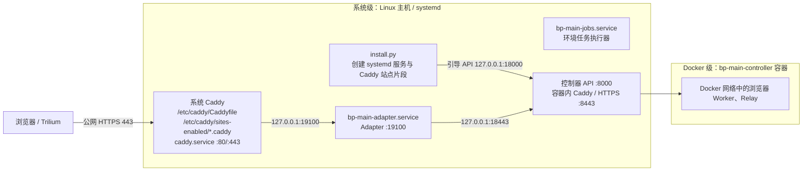

# 安装部署：端口、配置文件与管理员

[文档导航](README.md) · [安装器说明](../infra/deployment/README.md) · [运维与恢复](operations.md) · [1.0发行材料](releases/v1.0.md)

实际验证：[2026-10-04按本说明全新安装](acceptance/deploy-v1-doc-install-2026-10-04.md)通过，覆盖配置管理员、真实跨用户服务、公网TLS管理及三引擎Google起始页/画面/输入/正常关闭删除。公网入口随后已统一迁移到系统级 `caddy.service`；当前安装器直接向系统 Caddy 的站点目录安装片段。

新安装使用主分支的 `infra/deployment/install.py`。将域名、目录、端口和首次管理员写进私有JSON文件，先检查，再安装。安装器创建独立系统用户、三个项目服务，并把入口站点加入系统 Caddy；同时创建空浏览器目录，安装内置4指纹/2显示/24组合。管理员登录后自行创建浏览器。

`--config` 和配置文件管理员功能由[R6BA](work-items/R6BA-2026-10-03-deployment-config.md)新增。固定 `v1.0` 标签/原程序包中的旧安装脚本不支持它；使用**当前主分支安装器 + 原已验证的1.0程序包**，无需改写旧包清单。Git源码不包含完整镜像、冻结产物和程序发布包，仅clone仓库不能完成安装。材料摘要和存放位置见[发行记录](releases/v1.0.md)。

## 1. 运行边界、结构和端口

准备两个指向同一服务器的域名：例如 `browser.example.com` 提供登录和管理，`session.example.com` 提供浏览器画面。两者共用公网443，不是每个域名开一个端口；两个域名的请求都经过Adapter授权。



图中“系统级”表示主机上的 systemd 服务、主机监听端口和 `/etc/caddy` 配置；“Docker级”表示容器内部进程、Docker 网络、镜像和容器挂载。`bp-main-controller` 容器内部仍有一个 Caddy，它是控制器的一部分，不是第二个公网入口。

| 层级 | 默认端口 | 用途与访问范围 | 如何修改 |
| --- | --- | --- |
| 系统级 | TCP 443 | 系统 Caddy 公网 HTTPS：登录、管理、远程画面和 WebSocket | 生产固定443；站点域名写 `https://域名` |
| 系统级 | TCP 80 | 系统 Caddy 的 HTTP→HTTPS 跳转和 ACME HTTP 验证 | 生产固定80 |
| 系统级 | TCP 19100 | 系统 Caddy 转给 Adapter 的本机 HTTP 入口，仅 `127.0.0.1` | `adapter_port` / `--adapter-port` |
| 系统级 | TCP 18443 | Adapter 访问控制器 API/显示后端的本机 HTTPS 映射，仅 `127.0.0.1` | `backend_port` / `--backend-port` |
| 系统级 | TCP 18000 | 安装时建立控制身份的 API 引导映射，仅 `127.0.0.1` | `api_port` / `--api-port` |
| Docker级 | 容器内 TCP 8000、8443 | 控制器 API 和内部 Caddy；由18000/18443映射进入 | 不修改容器内端口，只改宿主机映射 |
| 系统级 | SSH端口，常见22 | 运维登录服务器，由 SSH 服务配置 | 不归本项目安装器管理 |

**通常只向公网放行80、443和你自己的SSH端口。** 三个后台端口不要开放到公网；安装器已绑定回环地址。UDP443仅用于可选HTTP/3，TCP443仍是必要入口。浏览器不需要各开一个公网端口；代理供应商端口在代理配置中设置，与安装端口不同。

安装器在实例根目录生成该实例的 Caddy 站点片段，并复制到 `/etc/caddy/sites-enabled/<实例名>.caddy`；系统 `/etc/caddy/Caddyfile` 只需包含一次 `import /etc/caddy/sites-enabled/*.caddy`。公网入口始终由系统 `caddy.service` 提供，安装器不创建 `bp-<实例名>-front.service`，也不启动第二个公网 Caddy。已有站点配置保留在系统 Caddy 中，新的域名以独立片段加入；同一域名不能在主配置和片段中重复定义。

安装前应确认系统 Caddy 使用 `/etc/caddy/Caddyfile` 启动和重启，而不是只从 autosave 恢复；安装器会执行 `systemctl enable --now caddy.service`，验证系统 Caddy 配置，并在安装完成后通过 systemd 重启使片段生效（服务可关闭 Caddy admin API）。若系统 Caddy 已有其他站点，安装器只追加一次 `sites-enabled` import 和当前实例片段，不覆盖其他站点。系统 Caddy 仍是整台主机唯一的80/443入口。

18000的映射在安装完成后仍保留，不会用一次就关闭；正常Adapter使用18443。19100是安装器默认值，组件示例的9100和旧文档的8443属于不同配置，不能混用。

三个后台端口必须是**不同的1024～65535整数**，且未被其他服务占用。生产入口目前不支持改成8443等非标准公网端口。`--private-tls` 仅供隔离QA：两个域名可用同一个自定义高位HTTPS端口，只监听回环并禁用公开80/自动HTTPS；它不是公网部署模式。

## 2. 准备机器和发布材料

需要Linux amd64、systemd、Python 3.11+、`python3-cryptography`、Docker Engine、Compose v2、系统 Caddy（支持 `format filter`，`caddy.service` 读取 `/etc/caddy/Caddyfile`）。原独立机验收使用Debian 12。Docker/Compose和系统 Caddy从发行版或Docker官方仓库安装；安装器检查依赖，不自动安装系统软件。

实际安装以root执行，新建非root服务用户并加入Docker组。实例名、系统用户名、安装目录和端口不能与已有实例重复。已有网站应继续由系统 Caddy 管理；若另一个进程占用80/443，先迁移入口或停止冲突服务，不能再启动第二个公网入口。

下面命令为普通运维用户编写；如果已在root终端，省略 `sudo`，用自己的编辑器替代 `sudoedit`。

### 三个包在哪里、怎样取得

安装材料通过 [GitHub Release v1.0](https://github.com/scrtou/browser-platform/releases/tag/v1.0) 下载，无需SSH或原独立机器。大文件作为Release附件保存，不进入Git提交；`git clone` 只取得源码。

| 文件 | 大小 |
| --- | --- |
| `browser-platform-1.0-linux-amd64-v4.tar.gz`（程序包） | 161,372,631字节，约154 MiB |
| `v1-exact-images.tar.gz.part-01`（基础镜像第一卷） | 1,992,294,400字节，1900 MiB |
| `v1-exact-images.tar.gz.part-02`（基础镜像第二卷） | 295,326,624字节，约282 MiB |
| `controller-managed-startup-image.tar.gz`（控制器更新包） | 95,798,408字节，约91 MiB |
| `SHA256SUMS` | 三个原包和两个分卷的SHA-256清单 |

基础镜像原包为2,287,621,024字节，超过GitHub单附件小于2 GiB的限制，因此拆成两卷，合并后与原包完全一致。**必须下载四个数据附件及校验清单**；GitHub自动提供的Source code压缩包不能代替它们。

在准备部署的新机器执行。保留分卷并合并时，下载目录至少预留5 GiB；解压、Docker镜像和浏览器数据另需空间。按本次1.0实机安装，三引擎镜像去重后的实际层约7.63 GiB，程序、实例根和内置数据约1.2 GiB；完整保留分卷、合并归档和其他附件时下载目录约4.6 GiB，清理重复分卷后约2.4 GiB。建议安装前至少有16 GiB可用空间，计划保留完整安装归档和后续浏览器数据时至少准备25 GiB。下载或校验失败时先解决错误，不继续安装：

```bash
mkdir -p ~/browser-platform-packages
cd ~/browser-platform-packages
(
  set -eu
  release_url=https://github.com/scrtou/browser-platform/releases/download/v1.0
  for file in browser-platform-1.0-linux-amd64-v4.tar.gz \
    v1-exact-images.tar.gz.part-01 v1-exact-images.tar.gz.part-02 \
    controller-managed-startup-image.tar.gz SHA256SUMS; do
    curl --fail --location --retry 3 --output "$file" "$release_url/$file"
  done
  sha256sum --ignore-missing -c SHA256SUMS
  cat v1-exact-images.tar.gz.part-01 v1-exact-images.tar.gz.part-02 > v1-exact-images.tar.gz
  sha256sum -c SHA256SUMS
)
```

最后一次校验须有五项 `OK`；完整原包摘要也列于[发行记录](releases/v1.0.md)。确认全部通过后解压、导入：

```bash
# 确保 /opt/browser-platform-1.0 尚不存在，再解压已核验的程序包。
sudo tar -xzf browser-platform-1.0-linux-amd64-v4.tar.gz -C /opt
sudo docker load --input v1-exact-images.tar.gz
sudo docker load --input controller-managed-startup-image.tar.gz
```

历史交付来源为独立机 `/srv/r6ax-v1-release-20261003/`，现安装取包无需访问它。本次发布只迁移公开安装材料；真实业务备份仍按原运维记录保管。

程序包解压后，例如放在 `/opt/browser-platform-1.0`，必须包含 `release-manifest.json`、`bin/`、`deployment/inputs.json`、控制器、runner、内置产物和运行依赖。安装密码文件放在发布目录之外。安装器选择七个精确镜像ID，不用可变tag代替；基础包中的旧控制器不参与新安装，实际使用更新包里的新控制器。安装器为这些镜像建立保留标签，避免被当成悬空镜像清理。

## 3. 编辑安装配置

从**当前Git仓库根目录**执行：

```bash
# 已有此文件时直接编辑，不要再次覆盖。
sudo install -m 600 infra/deployment/install.example.json /root/browser-platform-install.local.json
sudoedit /root/browser-platform-install.local.json
```

配置示例（JSON不能写注释）：

```json
{
  "release": "/opt/browser-platform-1.0",
  "root": "/srv/browser-platform",
  "name": "bp-main",
  "user": "bpservice",
  "entry_origin": "https://browser.example.com",
  "session_origin": "https://session.example.com",
  "adapter_port": 19100,
  "api_port": 18000,
  "backend_port": 18443,
  "admin": {
    "username": "myadmin",
    "password": ""
  }
}
```

换成实际域名，**把空 `password` 填成自己的密码**；空值会被拒绝，没有内置网页密码。若希望安装后再建管理员，删除整个 `admin` 对象或设为 `null`。

| 字段 | 含义与要求 |
| --- | --- |
| `release` | 已解压、校验过的程序包绝对路径，不是Git源码目录 |
| `root` | 新实例绝对路径，必须尚不存在、父目录已存在；不能填写已有数据目录 |
| `name` | 实例名，以 `bp-` 开头，例如生成 `bp-main-adapter.service` |
| `user` | 将新建的Linux服务用户；不能为root或已有用户，不是网页登录名 |
| `entry_origin` | 登录/管理入口的完整HTTPS域名，不带路径、查询参数 |
| `session_origin` | 浏览器画面的另一个HTTPS域名，不能与入口同域名 |
| 三个 `*_port` | 对应前表的后台端口；省略时为19100、18000、18443 |
| `admin.username` | 首次网页管理员；1～32位，小写字母/数字开头，之后允许小写字母、数字、`_`、`-` |
| `admin.password` | 首次网页密码；4～256个UTF-8字节，不含换行；支持中文/特殊字符，JSON的引号和反斜杠需转义 |

配置必须为私有普通文件（0400或0600，不接受符号链接），未知字段、重复字段及错误类型会被拒绝。密码只通过stdin交给现有账号工具，运行账号表保存带盐哈希；不会复制到运行配置、安装回执、服务环境或日志。

**原安装文件仍含明文密码。** 安装并确认登录后，可删掉其中的 `admin` 对象再留作端口记录，或存入自己的凭据管理位置；不要提交到Git。仓库已忽略以 `install.local.json` 结尾的本地文件，公开示例没有有效密码。

## 4. 检查、安装与覆盖端口

```bash
# 当前Git仓库根目录；此步不创建用户、服务、目录或管理员。
sudo python3 infra/deployment/install.py \
  --config /root/browser-platform-install.local.json --check-only

# 返回 INPUTS_VALID 后去掉 --check-only，执行实际安装。
sudo python3 infra/deployment/install.py \
  --config /root/browser-platform-install.local.json
```

`--check-only` 检查配置与程序清单，不代表镜像、端口、依赖或启动已验证；实际安装继续检查这些条件。成功结果是 `INSTALLED`、`ready_verified: true`。设置了 `admin` 时还应为 `web_admin_initialized: true`，打开入口域名直接登录；未设置时显示待初始化页。

**显式命令行参数覆盖配置文件，配置文件覆盖默认值。** 例如这次将三个后台端口换为另一组：

```bash
sudo python3 infra/deployment/install.py \
  --config /root/browser-platform-install.local.json \
  --adapter-port 21100 --api-port 21000 --backend-port 21443 \
  --check-only
```

实际安装必须使用同一组参数并移除 `--check-only`；检查命令不会修改原JSON。也可以直接改JSON里的三个数字，再执行上面的普通安装命令。

原纯CLI方式仍可使用，管理员稍后初始化：

```bash
sudo python3 infra/deployment/install.py \
  --release /opt/browser-platform-1.0 --root /srv/browser-platform \
  --name bp-main --user bpservice \
  --entry-origin https://browser.example.com \
  --session-origin https://session.example.com \
  --adapter-port 19100 --api-port 18000 --backend-port 18443 \
  --check-only
```

失败目录和私有日志会保留；不能对已生成目录重复运行全新安装器。先看错误码及 `<root>/install.log`，前置检查失败时可能尚未创建日志。端口冲突会明确显示 `PORT_UNAVAILABLE: 地址:端口`。按保留材料诊断，不删除真实数据来重试。

## 5. 安装后的文件、服务与账号

以 `/srv/browser-platform`、实例 `bp-main` 为例：

| 文件/服务 | 用途 |
| --- | --- |
| `adapter-config.json` | 实际运行配置：Adapter监听、后端HTTPS、账号表/业务目录路径 |
| `compose.json` | 控制器镜像、宿主端口映射和挂载 |
| `Caddyfile` | 当前实例的系统 Caddy 站点片段；安装后复制到 `/etc/caddy/sites-enabled/<实例名>.caddy` |
| `access/entry-users.json` | 网页账号和密码哈希，由账号工具/管理页维护 |
| `profiles.json` | 实际浏览器目录，初装为空 |
| `installation.json` | 安装结果、就绪、管理员初始化状态和系统 Caddy 站点路径 |
| `install-request.json` | 不含管理员密码的安装参数回执 |
| `bp-main-controller` | 控制器容器服务 |
| `bp-main-adapter` | 登录、管理和浏览器生命周期入口 |
| `bp-main-jobs` | 环境/指纹任务执行器 |
| `caddy.service` | 系统级公网 HTTPS 入口，统一监听80/443 |

Linux服务用户、网页管理员、SealSkin内部控制身份不同：`user` 用于系统服务，`admin.username/password` 用于网页登录，内部控制身份与密钥自动生成。无需填写SSH/root密码。

安装成功后三个项目服务和系统 `caddy.service` 都应设为开机启用。controller 是 `Type=oneshot`，正常状态显示为 `active (exited)`；adapter、jobs 和 caddy 应显示 `active (running)`。公网入口由系统 `caddy.service` 提供；项目不再创建 front 服务。

未配置 `admin` 时，用Bash读取密码并执行CLI：

```bash
read -r -s -p '管理员密码: ' bp_initial_password
printf '\n'
printf '%s\n' "$bp_initial_password" | sudo runuser -u bpservice -- \
  /srv/browser-platform/release/bin/profile-accounts init \
  --config /srv/browser-platform/adapter-config.json --user myadmin
unset bp_initial_password
```

`init` 只创建首次管理员，已有账号时拒绝。登录后可在页面改密码；更换登录名时先建新管理员并确认登录，再处理旧账号。**改安装配置中的密码不会重置已有账号，重启也不会重新套用。** 浏览器创建时须分配使用授权；管理员的管理权限不自动授予全部浏览器启动权限。

## 6. 已安装以后怎样改端口

安装JSON只在初装时读取；事后修改不会影响服务，也不能重跑安装器更新端口。实际对应关系如下：

| 修改宿主端口 | 必须同步修改的运行文件 |
| --- | --- |
| Adapter，例如19100→21100 | `adapter-config.json` 的 `listen_address`；`/etc/caddy/sites-enabled/<实例名>.caddy` 的 `reverse_proxy` 上游 |
| 后端HTTPS，例如18443→21443 | `compose.json` 的 `127.0.0.1:18443:8443` 中间端口；Adapter配置的 `sealskin.api_base_url` 和 `access.session_upstream_url` |
| 引导API，例如18000→21000 | `compose.json` 的 `127.0.0.1:18000:8000` 中间端口；如仍使用引导工具，更新 `access/bootstrap.json` 的 `server_endpoint` |

在维护窗口正常关闭受影响浏览器、确认操作完成并备份配置后，修改同一行列出的文件；保留回环地址和容器侧8000/8443。校验 Compose 和系统 Caddy 后重启 `caddy.service`，检查 readyz、HTTPS登录和浏览器恢复；失败时回滚本次配置。后端映射变化涉及控制器容器重建，不能只重启 Adapter。已有实例若使用多层Compose覆盖文件，须修改自己的有效配置链，不套用新的通用示例。

系统 Caddy 之外的 Nginx/Traefik 等已有反向代理拓扑迁移不由当前安装器自动处理；安装器只管理系统 Caddy 的站点片段。域名变化还影响 Cookie、TLS 和会话入口，应单独规划。

## 7. 检查与恢复

```bash
sudo systemctl is-enabled bp-main-controller.service bp-main-adapter.service \
  bp-main-jobs.service caddy.service
sudo systemctl status bp-main-controller.service bp-main-adapter.service \
  bp-main-jobs.service caddy.service
# readyz 按入口域名做 Host 路由；缺少正确 Host 会返回 421 Unknown entry。
curl --fail --header 'Host: browser.example.com' \
  http://127.0.0.1:19100/readyz
# 改过adapter_port时，使用自己的端口。
sudo ss -lntp
# 应看到系统 Caddy 占用 80/443，三个项目后台端口仅占用回环地址。
```

部署后至少用公网HTTPS客户端完成一次真实检查：访问 `/auth/login` 并登录，打开管理页，创建一个独立QA浏览器，确认起始页、远程画面和键盘输入，再执行正常关闭；确认无误后按管理页面流程归档删除QA浏览器。仅容器 running、systemd active 或 readyz 成功不能代替真实浏览器检查。服务重启后需重新登录。不要对在线Home直接打包，按[一致性备份](../infra/sealskin/checks/consistent-business-backup.md)和[运维](operations.md)处理；恢复到独立目录验证，全新安装器不能指向已有实例/恢复根。

公网入口检查应使用真实域名，例如 `curl --fail https://browser.example.com/auth/login`；不要把回环地址的自签名后端端口当作公网TLS检查。三种引擎的完整创建/显示/输入/关闭结果应分别记录，失败的浏览器和临时凭据必须清理后再收尾。

后端私有TLS证书有效期一年，需提前更新；公网Caddy自动续期依赖DNS和入站条件。完整本机安装、跨用户、真实公网TLS和三引擎浏览器证据见[2026-10-04安装验收](acceptance/deploy-v1-doc-install-2026-10-04.md)；历史固定版本安装证据见[R6AX](../infra/sealskin/r6ax-v1-install-acceptance-2026-10-03.md)，配置入口实现归R6BA。供应方自然漂移未测，独立机Firefox首次IndexedDB时延边界继续保留。
