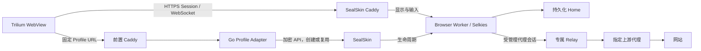

# 当前架构与设计决策

[文档导航](README.md) · [开发背景](background.md) · [开发进度](progress.md) · [开发计划](roadmap.md)

本页描述当前采用的架构及其边界。具体版本、生效范围与验收结果统一见 [开发进度](progress.md)；完整接口和能力要求见 [代理与环境规格](specs/proxy-environment/specification.md)。原 1–50 节长篇设计已完整保存在 [历史快照](archive/design-v1.3-2026-09-13.md)。

## 总体架构

Trilium 通过固定 URL 进入 Profile Adapter，Adapter 调用 SealSkin 创建或复用会话。浏览器画面、键鼠与剪贴板经过 SealSkin/Caddy/Selkies 数据通道，浏览器运行在独立 Docker Worker 中。

图中的专属代理路径用于受管理的新 Personal 会话。现存 Work/Personal 与独立 Camoufox 的配置、生效时机不同，见 [部署范围](progress.md#deployment)。

## 组件职责与状态归属

| 对象 | 当前所有者与职责 |
| --- | --- |
| 固定 Profile 入口与配置 | Adapter：Profile ID、应用/Home/策略引用、启动前校验 |
| 启动占用、绑定与停止意图 | Adapter：持久化 journal、operation、幂等键、保守对账、本机运维 socket |
| Session 与 Docker 生命周期 | SealSkin 及本地生命周期补丁：创建、停止、资源清查、确认删除 |
| 会话授权与显示转发 | SealSkin / Caddy；Selkies 处理画面与输入 |
| 浏览器数据与运行目录锁 | Worker 中的浏览器，数据放在命名 Home |
| 环境产物 | 构建/生成工具冻结版本与完整结果；Worker 在启动前验证并读取 |
| 受管理网络 | SealSkin 分配 generation 资源；Guard 安装规则，Relay 转发上游流量 |
| 上游代理凭据 | 私有版本文件只读交给 Relay，不进入 Worker、镜像、环境产物或 Home |
| 统一运行健康报告 | 规划由 Adapter 汇总，当前见 [R1](roadmap.md#r1) |

当前只有 SealSkin 操作这批 Worker 的 Docker 生命周期。Adapter 不再建立第二套 Docker 编排路径，也不复制完整的 SealSkin Session 状态机。

Adapter 已使用持久化状态文件、跨进程锁、fsync 和原子替换；SealSkin 保留自身会话记录及按 Home 保存的网络占用文件。[SQLite 规格](specs/proxy-environment/schema.sql) 是未来自有元数据的参考契约，不是当前数据库，也不是 SealSkin 数据迁移脚本。

## Profile、Home 与 generation

- **Profile** 是用户长期使用的逻辑身份，例如 Personal、Work。
- **Home** 是浏览器持久化目录，保存 Cookie、网站存储、设置和恢复所需数据。
- **Session** 是 SealSkin 提供授权与显示连接的一次运行会话。
- **Worker** 是运行浏览器、桌面与 Selkies 的容器。
- **generation / operation** 标识一次受管理的启动代次，用于绑定实际资源和拒绝过期操作。

一个 Home 同时只允许一个浏览器实例使用。并发和不确定结果通过持久化占用与实际资源对账处理；`unknown` 不按 TTL 自动解锁。旧无标签会话使用 Session、Home、应用与唯一 bootstrap 上下文精确匹配，新代次还使用确定名称、标签及配置摘要。

刷新 Trilium 只重新连接或授权已有 Session。更新应用定义影响后续新会话，不会替换仍运行的旧 Worker；升级浏览器或更换网络架构需要单独处理。

## 启动、复用与停止

1. `GET /browser/{profile}/` 返回入口页，不创建会话；受保护的 `POST /browser/{profile}/start` 请求启动或复用。
2. Adapter 保存启动占用和唯一 bootstrap 上下文，先核对实际绑定。结果未知时保留占用并拒绝重复创建。
3. 受管理的 SealSkin 启动在 Docker create 前保存网络占用，按代次分配网络、Relay 与 Guard。
4. Guard 规则安装并降权、代理与直连阻断探测通过、探测容器清理后，才启动 Worker；Worker 验证环境产物并使用命名 Home。
5. Adapter 从 SealSkin 获取授权 URL，以 303 跳转到 Session。授权 URL 不写入永久 Note 或状态文件。
6. 停止先持久化意图，确认全部 Worker 消失，再回收 Guard、Relay、网络及占用。失败时可重试或对账；全部资源消失后才提交 `stopped`，Home 保留。

控制容器重建会先核对所有权、网络端点、配置与旧控制器状态，再按原地址接回显示网络。普通非策略会话的完整 create 前日志、自动空闲回收、浏览器存活检测与整机自动恢复仍属于 [后续计划](roadmap.md)。实现细节见 [生命周期说明](../infra/sealskin/lifecycle/README.md)。

## 受管理 Personal 的网络边界

每个 generation 有独立 internal/egress 网络、Guard 和 Relay。Guard 只接内网，在自己的网络命名空间安装 nftables 后丢弃全部 capabilities；Worker 共享这个已经受限的命名空间。

| 方向 | 规则 |
| --- | --- |
| Worker → 自己的 Relay | 仅固定内网 IPv4 的 TCP 1080 |
| 固定控制器 → Worker 显示端口 | 允许授权显示通道；允许已建立连接的回复 |
| Worker → 公网、其他 Profile、管理 API、宿主机、metadata | 默认拒绝，覆盖 IPv4/IPv6 |
| Worker → Docker DNS / 直接 DNS | 拒绝；网站域名经 SOCKS5 交给上游解析 |
| Relay → 上游代理 | 仅控制器在分配时解析并冻结的 IPv4/端口 |
| 其他入站、出站或转发 | 默认拒绝 |

Worker 不获得 Docker socket、NET_ADMIN 或 NET_RAW。上游故障只使代理失败，不提供 VPS 直连回退。Guard 丢失时应停止并清理整个原代次后新建，不能单独重启 Guard 来接管仍存活的 Worker。

此处描述本平台的本地网络约束；上游代理所在网络的目标访问范围由上游 ACL 管理。DIRECT、其他代理协议和完整重启要求属于 [网络规格](specs/proxy-environment/specification.md#48-dns--webrtc--egress-leak-protection)，不能推定旧 Work 已具有同样隔离。

## 浏览器环境与版本

原生 Firefox 基线用镜像和启动校验固定 locale、languages、timezone、screen/DPR、DoH/WebRTC 等设置；它不包含 Camoufox 的低层生成配置。固定版本 Wayland 的屏幕观测未达标，因此新 Personal 基线使用 X11。

Camoufox 作为独立应用固定 Python 包、BrowserForge、浏览器发布、完整生成结果与 seeds。运行时只读取通过摘要、版本和成功报告校验的产物。Home 持久化与环境持久化分别验证；复用 Home 不足以证明环境稳定。

不同引擎使用各自 Home。升级与回退要配套处理镜像、Home 和产物快照，不能只改镜像标签。版本及结果见 [Camoufox 说明](../infra/camoufox/README.md) 和 [开发进度](progress.md)。

## 入口与客户端边界

固定入口和 Session 使用不同 origin：入口域名路由 `/browser/*` 与 `/bootstrap/*`，Session 域名承载授权、画面及 WebSocket。当前地址见 [客户端接入](trilium-client.md#接入地址)。Caddy 保留正确 Host 并校验 SealSkin 上游 TLS；最终用户入口鉴权仍需按发布门槛留下完整证据。

Trilium Core 保持原样。主动原生 copy/paste 事件与 Selkies 面板支持已验收的文字/截图传递；WebView 的程序剪贴板访问限制继续存在。浏览器关闭而 Worker 存活时，刷新仍会复用空桌面，恢复操作见 [客户端说明](trilium-client.md#关闭远程-firefox-后出现黑框)。

## 设计决策

沿用原 ADR 编号，以下说明其在当前实现中的含义。

| 决策 | 当前含义 |
| --- | --- |
| ADR-001 · Linux 生产运行 | 网络、容器和桌面联调在 Linux；实际主机与目标版本分别记录 |
| ADR-002 · Go 入口适配层 | 用 Go 实现固定入口与控制契约；独立 Go Broker 保留为备选 |
| ADR-003 · 不修改 Trilium Core | 优先通过服务端和网页客户端完成接入 |
| ADR-004 · Worker 临时、Profile 持久 | 数据、环境产物与容器生命周期分离 |
| ADR-005 · Home 独占 | 单实例、持久化占用与实际资源核对共同保证 |
| ADR-006 · 代理与环境长期绑定 | 绑定具体修订；运行观测不自动改写环境 |
| ADR-007 · 引擎可替换 | 通过受控新 Home 和能力验收替换，当前不提供任意引擎互换 |
| ADR-008 · SealSkin 优先 | 当前复用 SealSkin，补丁范围可审计；独立 Docker Broker 未启动实施 |
| ADR-009 · 后端由验收与维护成本决定 | 同一批 Worker 始终只有一个生命周期管理者 |
| ADR-010 · Persona Studio 可选 | 不是当前生产或 MVP 的前置依赖 |

上游已知缺口及本地处理见 [SealSkin 审计](sealskin-0.3.2-audit.md)。原始理由和备选方案保存在 [历史 ADR](archive/design-v1.3-2026-09-13.md#38-architecture-decision-records)。

## 原章节定位

原设计的其他章节、API 草案、M0–M19 和推荐目录结构保存在 [完整快照](archive/design-v1.3-2026-09-13.md)。下列锚点兼容已有引用，新文档应直接链接到对应现行页面。

- 原第 44 节：[版本定义与发布门槛](roadmap.md#release-criteria)。

- 原第 45–50 节：[代理、环境、网络、健康与凭据规格](specs/proxy-environment/specification.md)。

- 原第 48.5 节：[N01–N08 网络故障验收](specs/proxy-environment/specification.md#485-首版网络故障验收)。
