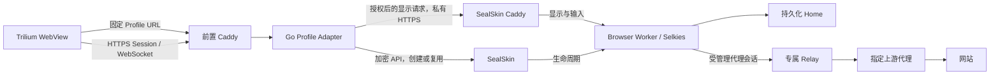

# 当前架构与设计决策

R6AP 已验证独立机器的镜像导入、三引擎合成 Home 恢复和最新权限审查。恢复仍保留单一控制器所有权；真实历史备份与当前控制目录不得未经时点对账同时激活。见[验收](../infra/sealskin/r6ap-remote-recovery-acceptance-2026-10-02.md)。

R6AI容量发布：已收尾并部署：容量改为按机器CPU/内存/磁盘自动推导，保留逐项覆盖和实时内存/并发预算保护；当前机器算得4个活动、1个并发，迁移重新计算。两套Go test/vet、容量race、只读诊断与保护发布通过，原浏览器和会话保持。 见[验收](../infra/sealskin/r6ai-capacity-release-acceptance-2026-10-02.md)。

R6AE更新：修改密码在首页/管理页打开共享弹窗，原地址保留无脚本回退；密码创建、重置和自助修改最低4、最高256个UTF-8字节，原哈希强度、当前密码验证、CSRF和其他登录撤销语义保留。浏览器详情按概览、常用设置、网络、环境模板、危险操作分页签，代理/账号按实际功能分组；短表单保持单页。指纹四类删除为直接按钮打开对象确认框，原引用保护和确认勾选保留。 见[本项验收](../infra/sealskin/r6ae-dialog-layout-password-acceptance-2026-10-02.md)。

[文档导航](README.md) · [开发背景](background.md) · [开发进度](progress.md) · [开发计划](roadmap.md)

本页描述当前采用的架构及其边界。具体版本、生效范围与验收结果统一见 [开发进度](progress.md)；完整接口和能力要求见 [代理与环境规格](specs/proxy-environment/specification.md)。原 1–50 节长篇设计已完整保存在 [历史快照](archive/design-v1.3-2026-09-13.md)。

2026-09-29 当前部署见 [R7F 续跑验收](../infra/sealskin/r7f-production-review-acceptance-2026-09-29.md)：入口授权、Secret Store 与管理目录已上线；Adapter `346d6377…` 保留控制器 DIRECT 能力观测。Work 迁移/公网及目标客户端仍待验收。下文 R5/R6 候选名称定位契约与历史证据，不表示生产仍处于当时的发布前阶段。

## 总体架构

Trilium 通过固定 URL 进入 Profile Adapter，Adapter 调用 SealSkin 创建或复用会话。浏览器画面、键鼠与剪贴板经过 SealSkin/Caddy/Selkies 数据通道，浏览器运行在独立 Docker Worker 中。

图中的显示访问边界由 R5D 验证，并随 R4B/R6F 组合部署。受管理网络按 Profile 代次绑定；当前“测试”运行，Personal/Work 停止，具体生效范围见 [部署范围](progress.md#deployment)。

## 组件职责与状态归属

| 对象 | 当前所有者与职责 |
| --- | --- |
| 固定 Profile 入口与配置 | Adapter：Profile ID、应用/Home/策略引用、启动前校验 |
| 启动占用、绑定与停止意图 | Adapter：持久化 journal、operation、幂等键、保守对账、容量门槛、空闲回收（可选）、本机运维 socket |
| Session 与 Docker 生命周期 | SealSkin 及本地生命周期补丁：create 前启动日志、创建、停止、资源清查、确认删除、Home 删除保护 |
| 会话授权与显示转发 | R5D 候选：Adapter 校验最终用户、Profile 与当前 Session；私有 SealSkin/Caddy 继续核对 Session 能力和一致性门槛；Selkies 处理画面与输入 |
| 浏览器数据与运行目录锁 | Worker 中的浏览器，数据放在命名 Home |
| 环境产物 | 构建/生成工具冻结版本与完整结果；Worker 在启动前验证并读取 |
| 受管理网络 | SealSkin 分配 generation 资源；Guard 安装规则，Relay 转发上游流量 |
| 上游代理凭据 | 私有版本文件只读交给 Relay，不进入 Worker、镜像、环境产物或 Home |
| Worker 显示材料 | 控制器从密封 Session 在专属 tmpfs 重建；Worker 只读自己的密码校验文件与可选协作 token，显示 TLS 私钥也留在 Worker tmpfs |
| 统一运行健康报告 | Adapter 汇总：读取 journal 绑定与 SealSkin 只读观测（进程、显示端口、Relay/Guard、上游探测），按规格计算整体状态并给出恢复提示；查询不启动或重建实例 |

当前只有 SealSkin 操作这批 Worker 的 Docker 生命周期。Adapter 不再建立第二套 Docker 编排路径，也不复制完整的 SealSkin Session 状态机。

Adapter 已使用持久化状态文件、跨进程锁、fsync 和原子替换；SealSkin 保留自身会话记录及按 Home 保存的网络占用文件。[SQLite 规格](specs/proxy-environment/schema.sql) 是未来自有元数据的参考契约，不是当前数据库，也不是 SealSkin 数据迁移脚本。

## Profile、Home 与 generation

R7F 的无策略旧 Work 迁移使用服务端批准的完整应用与精确镜像，单独持久化 `migrating/pending_migration`，在同一生命周期锁内完成策略追加、应用替换、读回及目录提交；网络迁移和回退均保留原 Home、Firefox/Wayland 与停用状态。Adapter 不操作 Docker，也不从原生 Firefox 推断 Camoufox 模板。启动在取得生命周期锁之后读取目录，防止等待期间跨过更新门禁；具体契约见[管理规格](specs/proxy-environment/management.md#r7f-存量无策略-work-的受控迁移)。

- **Profile** 是用户长期使用的逻辑身份，例如 Personal、Work。
- **Home** 是浏览器持久化目录，保存 Cookie、网站存储、设置和恢复所需数据。
- **Session** 是 SealSkin 提供授权与显示连接的一次运行会话。
- **Worker** 是运行浏览器、桌面与 Selkies 的容器。
- **generation / operation** 标识一次受管理的启动代次，用于绑定实际资源和拒绝过期操作。

一个 Home 同时只允许一个浏览器实例使用。并发和不确定结果通过持久化占用与实际资源对账处理；`unknown` 不按 TTL 自动解锁。旧无标签会话使用 Session、Home、应用与唯一 bootstrap 上下文精确匹配，新代次还使用确定名称、标签及配置摘要。

刷新 Trilium 只重新连接或授权已有 Session。更新应用定义影响后续新会话，不会替换仍运行的旧 Worker；升级浏览器或更换网络架构需要单独处理。

## 启动、复用与停止

1. `GET /browser/{profile}/` 返回入口页，不创建会话；启用 `access` 后先验证短期登录与 Profile 授权，再由带精确 Origin/CSRF 的 `POST /browser/{profile}/start` 请求启动或复用。
2. Adapter 保存启动占用和唯一 bootstrap 上下文，先核对实际绑定。结果未知时保留占用并拒绝重复创建。
3. 受管理的 SealSkin 启动在 Docker create 前保存网络占用，按代次分配网络、Relay 与 Guard。
4. Guard 规则安装并降权、代理与直连阻断探测通过、探测容器清理后，才启动 Worker；Worker 验证环境产物并使用命名 Home。
5. Adapter 核对当前 Session 与一致性门槛，将后端能力保存在内存，向客户端发放一次性短期交接地址。兑换再次核对当前登录与业务绑定，设置专属显示 Cookie，再以 303 跳转到不含后端 token 的 Session URL；后续 HTTP/WebSocket 经 Adapter 和私有控制器授权。Note 只保存固定 Profile 入口。
6. 停止先持久化意图；支持正常退出的 Worker 先关闭浏览器并确认退出，关闭拒绝/超时保留资源。确认全部 Worker 消失，再回收 Guard、Relay、网络及占用。失败时可重试或对账；全部资源消失后才提交 `stopped`，Home 保留。

控制容器重建会先核对所有权、网络端点、配置与旧控制器状态，再按原地址接回显示网络。传统运行健康观测在 Home 锁外只读进行；R5C3 的实际浏览器采样和门槛更新沿用 Home 生命周期互斥。

R5C1 的 `profile_initial_url_version: 1` 将受管理浏览器的 HTTP(S) 初始 URL 与唯一 bootstrap 对账标记分开：`launch_context` 保留原标记，Worker 直接打开配置的起始页。DIRECT 继续拒绝宿主机地址。两个实际 Adapter 入口、重复进入和持久数据已验证；旧控制器不接收新字段，无绑定会话仍为 unknown，见 [启动中转页修复](deviations/DEV-2026-09-14-011-direct-bootstrap-url.md)。

Docker 或主机重启后，Profile 的 Worker、Guard、Relay（均 `restart=no`，不使用自动删除）保持为已退出容器，会话记录与网络占用保留，称为**休眠代次**。Adapter 启动对账或入口识别休眠代次后，由 SealSkin 按 **Relay → Guard 规则就绪 → 控制器接回内网 → 一次性探测（代理 TLS 通过且直连阻断）→ Worker → 显示端点** 的顺序恢复同一批容器；任一步失败 Worker 不启动，占用保留并标为 `unknown`。恢复从不创建或删除容器。

所有命名 Home 的启动在 Docker create 前写入启动日志，控制进程崩溃或创建响应丢失后由清单中的 `launch` 资源暴露并阻止重复启动；清单为空即证明没有创建发生。Home 删除只在会话、容器、网络占用与启动日志全部不存在时执行。空闲回收以 SealSkin 代理持有的已认证显示连接数为唯一依据：断开后计时、重连取消、到期前重新观测，再经已验证的停止路径释放；轮询、健康检查与视频帧不算活动。自动重开浏览器与整机自动开机验收仍属于 [后续计划](roadmap.md)。实现细节见 [生命周期说明](../infra/sealskin/lifecycle/README.md)。

## 受管理 Personal 的网络边界

每个 generation 有独立 internal/egress 网络、Guard 和 Relay。Guard 只接内网，在自己的网络命名空间安装 nftables 后丢弃全部 capabilities；Worker 共享这个已经受限的命名空间。

| 方向 | 规则 |
| --- | --- |
| Worker → 自己的 Relay | 仅固定内网 IPv4 的 TCP 1080 |
| 固定控制器 → Worker 显示端口 | 允许授权显示通道；允许已建立连接的回复 |
| Worker → 公网、其他 Profile、管理 API、宿主机、metadata | 默认拒绝，覆盖 IPv4/IPv6 |
| Worker → Docker DNS / 直接 DNS | 拒绝；网站域名经内部 SOCKS5 交 Relay，再以所选 SOCKS5/CONNECT 请求交上游解析 |
| Relay → 上游代理 | 静态代次仅控制器在分配时解析并冻结的 IPv4/端口；显式动态域名代次通过控制器原子 endpoint lease 使用当前 IPv4/端口 |
| 其他入站、出站或转发 | 默认拒绝 |

Worker 不获得 Docker socket、NET_ADMIN 或 NET_RAW。上游故障只使代理失败，不提供 VPS 直连回退。Guard 丢失时应停止并清理整个原代次后新建，不能单独重启 Guard 来接管仍存活的 Worker。

上表为 `proxy_required` 的本地网络约束；上游代理所在网络的目标访问范围由上游 ACL 管理。R5C1 的显式 DIRECT 候选保留相同的 Worker/Guard 约束，专属网关只允许批准解析器的 UDP/TCP 53 与通过地址校验的公开 IPv4 TCP；不创建外部 ProxyConfig 或凭据。完整域名回答、CNAME、私网/保留地址、宿主机公网地址和 53/853 目标均检查；不用系统 DNS 或 hosts，没有应用级 DNS 缓存。

DIRECT 控制器与网关只读挂载固定宿主机 procfs 地址证据，冻结本机原生公网 IPv4；NAT-only 主机不支持。网关每次连接前和每 100 ms 复核证据，丢失/变化关闭监听与已有隧道；恢复/重接再次核对配置、地址和挂载。私网拒绝前仅放行已建立 SOCKS5 连接的回复方向（[DEV-010](deviations/DEV-2026-09-14-010-direct-reply-filter.md)）。DNS 故障阻止新的域名连接，数值地址与既有隧道仍由 ACL 管理。配置和独立验收见 [DIRECT](../infra/sealskin/lifecycle/direct-network.md)。2026-09-30 生产 Work 已受控迁入独立 DIRECT，新代次 Worker 域名/TLS/HTTPS 与绕过拒绝检查通过；Firefox GUI/重建/数据及目标客户端范围见 [R7F 验收](../infra/sealskin/r7f-legacy-migration-acceptance-2026-09-30.md)。公开 DNS/TTL 已在 R5C2 的限定 QA 环境验收；完整主机重启和一致性报告仍按 [网络规格](specs/proxy-environment/specification.md#48-dns--webrtc--egress-leak-protection) 验收。

R5C2 候选把代理端点引导 DNS 独立配置为 `bootstrap_resolver_id` / `bootstrap_resolver_ip`。批准路径只查询固定数值端点，以有界 UDP/TCP、CNAME 和完整 IPv4 校验取得回答；数值上游不执行 DNS。回答、TTL 和接收时间绑定 Home/operation/策略，恢复和控制器重接核对冻结配置与挂载。静态代次 TTL 到期不更换运行端点或释放 Home，新代次才重新解析。R7G 对非数值 `upstream_host` 增加显式动态模式：控制器按 TTL 触发重新解析，Relay 使用递增 revision 的 endpoint lease，Guard 按旧/新集合原子过渡；既有 TCP 连接不迁移，失败则回滚或停止 Relay 维持默认拒绝。空字段保留旧策略 SHA 及 `legacy_system` 路径，该路径不能算批准解析器通过。依赖、记录和兼容边界见 [引导 DNS 契约](../infra/sealskin/lifecycle/bootstrap-dns.md)。公开委派、三条实际解析路径和真实 TTL 已在独立标准 Unbound 与受控公网端点完成验收；该结果不推论公共递归前端只有一个缓存期限，也不代替运行时新鲜一致性报告。

[R5A](work-items/R5A-2026-09-14-proxy-protocols.md) 保留内部 SOCKS5，扩展上游 HTTP/HTTPS CONNECT 与明确认证矩阵；HTTPS 在冻结 IP 上验证原始代理主机名。旧策略的规范化摘要保持不变，新协议配置通过新修订采用。六组协议/认证及正常退出修复已完成隔离验收；该候选没有独立发布，R4B 后续组合已把当前固定 SOCKS5 策略和匹配正常退出能力部署生产，其他协议仍只引用 R5A 范围证据。内部协议映射和握手超时偏差分别见 [DEV-006](deviations/DEV-2026-09-14-006-internal-proxy-protocol.md)、[DEV-005](deviations/DEV-2026-09-14-005-relay-handshake-timeout.md)。

## 运行时一致性候选

R5C3 在原运行健康上增加控制器拥有的实际页面、socket 出口、指定 GeoIP 推断及网络拒绝证据。报告与 Profile/Home/operation/Session、三类容器 ID/启动时间、策略和环境产物绑定；Adapter 每个 Session 发放路径都核对新鲜必需项和代次门槛，公开 GET 只读当前绑定缓存。缺失或过期为 UNKNOWN，城市可选 UNKNOWN 为 DEGRADED；语言与国家不同不自动失败，strict/advisory 只执行明确约束。

Relay 的初始/失败/到期门槛关闭普通网站新旧连接，只保留受限观测路径。控制器每 30 秒开始续查，60 秒到期不延长；确认拓扑/规则漂移或绕过时暂停精确 Worker。出口变化 block 按代次保留锁定；比较历史与相应报告原子保存，跨 UNKNOWN/同代次恢复保留，但新鲜报告仍因启动时间变化而失效。浏览器观测仅操作自己创建的隐藏标签，loopback 控制通道不公开。字段与停止/恢复要求见 [运行时一致性契约](../infra/sealskin/lifecycle/runtime-coherence.md)。候选的代码与隔离验收不改变生产部署范围。

## 凭据存储与恢复

[R5B](work-items/R5B-2026-09-14-secret-store.md) 的候选实现 FileSecretStore：配置只保存一对不可变版本引用，AES-256-GCM 认证密文和 owner/Profile/Home/App 授权；主密钥在独立私有目录。控制器在启动/恢复提交期间持有凭据锁，只向对应 generation 的主机 tmpfs 写入临时材料，Relay 只读挂载整个目录，Worker 不获得凭据或主密钥。

普通停止和紧急撤销先保存意图/禁用并阻断出站，再正常关闭浏览器。Relay 的租约监测关闭已有隧道；控制器启动及后台授权检查处理撤销中断和密钥丢失。失败保留 Home/占用，重试才确认清理。age 备份包含 Home、入口 journal、固定产物及必要身份/解密材料；新目录恢复默认锁定，合并当前撤销并持久化启用记录后才能离线重绑。上述范围已完成 [隔离验收](../infra/sealskin/secret-store-acceptance-2026-09-14.md)，未部署；真实 Home/整机恢复仍归 R2。操作和兼容限制见 [组件说明](../infra/sealskin/lifecycle/secret-store.md)。

R2A 为无 Store、入口登录或密封 Session 的旧生产提供独立加密格式：运行时只读快照区分实际旧镜像和配置中的下次镜像，同一 operation 停止确认后才能归档。缺少冻结产物时保留 `observed-legacy-runtime` 的事实范围，不伪造环境通过。旧格式恢复只作离线重绑准备，提示文件不是旧控制器执行的门槛；原 Store 撤销/账号保护保持。工具及只读准备结果见 [R2A 验收](../infra/sealskin/legacy-backup-acceptance-2026-09-15.md)，真实 Home 的可恢复性仍须 R2 证明。

## 浏览器环境与版本

原生 Firefox 基线用镜像和启动校验固定 locale、languages、timezone、screen/DPR、DoH/WebRTC 等设置；它不包含 Camoufox 的低层生成配置。固定版本 Wayland 的屏幕观测未达标，因此新 Personal 基线使用 X11。

Camoufox 作为独立应用固定 Python 包、BrowserForge、浏览器发布、完整生成结果与 seeds。运行时只读取通过摘要、版本和成功报告校验的产物。Home 持久化与环境持久化分别验证；复用 Home 不足以证明环境稳定。

R5A 发现 TERM 不等于正常浏览器退出，最近 localStorage 写入可能丢失，见 [DEV-008](deviations/DEV-2026-09-14-008-resume-storage-observation.md)。新的 [退出层](../infra/browser-runtime/README.md) 在 X11/桌面存活时请求窗口关闭；显式 API 在未确认退出时保留 Worker 和占用，容器停止钩子也先尝试同一正常关闭。该能力由新镜像标签与控制清单版本声明，旧生产 Worker 不据此获得保证；强制结束、OOM 和断电仍属于未完成正常退出的场景。

R4B 为保留 Work 的 Firefox/Wayland 增加原生窗口关闭候选：限定单一已核对的 Firefox 主进程、可信 labwc socket 及 version 3 顶层管理协议，只关闭无 parent 的 `firefox` 窗口。协议没有逐窗口 PID，不能用于任意 Wayland 桌面。真实控制器 stop 的关闭拒绝/重试、s6 停止与 resume、入口显示认证、五类错误材料和三类存储恢复已通过隔离验收；候选未部署，见 [DEV-042](deviations/DEV-2026-09-15-042-work-wayland-shutdown.md)。

Camoufox 准备器支持由 SealSkin 分配 Guard/Relay 的受管理网络；该模式禁止同时指定静态 Docker network。冻结产物与成功报告继续只读挂载，生命周期所有权不变。此路径已通过 R4A 隔离验收；生产独立应用仍使用此前的静态网络，实际切换留待 R4B。

不同引擎使用各自 Home。升级与回退要配套处理镜像、Home 和产物快照，不能只改镜像标签。版本及结果见 [Camoufox 说明](../infra/camoufox/README.md) 和 [开发进度](progress.md)。

迁移准备只生成候选 App、策略及 Adapter 正向/回退配置，记录当前实际绑定和摘要。实际切换必须先用旧配置完成 stop 并确认资源释放，随后让 Adapter 在下一次启动写入新绑定；回退也走已验证 stop，保留 journal 和两个 Home。

R4B 的迁移契约还要求目标镜像与实际控制器能力匹配：精确镜像的正常退出/显示认证标签转换为 Profile 的 `required_runtime_capabilities`，准备器从当前 Adapter inspect 核对，Adapter 在创建 Home、发起启动/复用和恢复前再次核对。能力未知或版本不匹配时不创建新代次；实际启动后的能力漂移保留 unknown 占用，停止路径继续可用。共享控制器的升级须核对所有 Profile 的后续新建镜像，旧 Work 的兼容恢复不能证明它可以在新显示契约下再次创建，见 [DEV-040](deviations/DEV-2026-09-15-040-migration-controller-capabilities.md)。

目标客户端要求浏览器铺满远程桌面。R4B 将默认窗口从 1600×900 修订为 1920×1080、位置 (0, 0)，screen 1920×1080 / DPR 1 保持固定；这是新的环境产物修订，须重新验收后启用。原始 BrowserForge 结果作为生成来源保留，原生窗口配置按显式规格覆盖；其余设备、seeds、preferences 保持。r9 在精确 r7 镜像上增加去除 Openbox 边框的桌面层，重新绑定镜像并验收；不能在旧产物下临时最大化来绕过 inner/outer 一致性，见 [DEV-041](deviations/DEV-2026-09-15-041-camoufox-window-size.md)。

加密归档必须包含当前网络策略引用的 `coherence-assets/`，连同 Home、完整环境/成功报告、Store、密封状态密钥和授权身份保存；创建和解密阶段核对路径、摘要与成员。恢复先离线合并当前撤销和账号授权，再重绑新根并取得实际新鲜报告。[R5E](../infra/sealskin/release-combination-acceptance-2026-09-15.md) 已验证单 QA Home 的这一组合，生产真实 Home 和切换仍归 R2/R4B。

## 入口与客户端边界

固定入口和 Session 使用不同 origin。R5D 候选将两个公开域名全部路由到 Adapter，由短期登录、Profile 授权和一次性交接保护画面及 WebSocket；SealSkin API 与原 Session 监听保持私有并校验 TLS。登录/账号状态与业务 journal 分开，访问撤销只关闭显示，不新增生命周期所有者。私有能力头仍经过控制器的 `session_gate`；它在转发 Worker 前被删除。重复交接保留同一显示 Cookie；完整 Selkies 客户端遵循单 primary 接管规则，另一个画面接管时保持 Worker/Home/Session。

Session 持久化使用独立密钥密封，Worker 使用 [专属显示材料](../infra/browser-access/README.md)，各层日志和 HTTP 异常只保留受控输出。真实客户端、五类错误材料拒绝及恢复后扫描已通过 [R5D 隔离验收](../infra/sealskin/entry-authentication-acceptance-2026-09-15.md)，QA 已清理，生产未切换。配置、迁移/回退与已知边界见 [访问契约](../infra/sealskin/entry-auth/README.md)，当前地址见 [客户端接入](trilium-client.md#接入地址)。

Trilium Core 保持原样。主动原生 copy/paste 事件与 Selkies 面板支持已验收的文字/截图传递；WebView 的程序剪贴板访问限制继续存在。浏览器关闭而 Worker 存活时，固定入口先显示恢复提示并保留手动进入；直接进入仍会复用空桌面。已登记运行模板的 Profile 必须经生命周期安全关闭原代次后再从固定入口重建，不能用基础桌面的系统 Firefox 代替；无模板元数据的历史原生 Firefox 才保留旧的桌面重开路径。恢复操作见 [客户端说明](trilium-client.md#关闭远程-firefox-后出现黑框)；自动重开尚未实现。

远程→本机仅支持纯文本，未交付反向图片、HTML/RTF 或文件下载。Unicode 输入按 code point 处理；系统 `LC_ALL` 使用 POSIX UTF-8 locale，不能直接套用浏览器 BCP 47 标签。显示、组合输入、文件与重连的证据按平台分列于 [客户端矩阵](client-matrix.md)，CDP 事件不能替代 Mac 原生输入法/Finder 验收。

## R6 远程浏览器管理面

2026-09-17 用户需求：一个面板可以新增/删除/修改远程浏览器，为每个浏览器配置代理（不配置即直连）、指纹（固化或自定义）、浏览器页面的登录 URL 与账号密码。具体契约见[管理面规格第 2 版](specs/proxy-environment/management.md)；R6A–R6F 已按范围收尾；当前部署及 R7 后续见进度。相对第 1 版提案的架构变化：

- **Profile 定义从静态配置变为 Adapter 私有的可修订目录**（`profiles.json`）：运行中可增删改，写入沿用 journal 的 flock/fsync/原子替换与乐观锁；现有配置文件中的 Profile 首次启用时原样导入。Adapter 仍是业务授权与 Profile 状态所有者，SealSkin 仍是唯一的 Session/Docker 生命周期所有者。
- **Adapter 增加只用于管理面的管理员 SealSkin 客户端**（独立密钥），负责按 Profile 修订安装/更新/删除应用定义与创建 Home；策略修订与 Secret Store 导入沿用控制器已有格式与授权模型，只追加不改历史。生命周期调用继续使用原用户身份。
- **网络二选一**：受管理代理（http/https/socks5，草稿 → 隔离探针 → 不可变修订 → 下一代次）或受管理 DIRECT（R5C1）。“不配置代理”就是 DIRECT，不是无 Guard 的裸容器网络；DIRECT 的生产前置（主机 IPv4 证据、网关镜像、控制器能力）成为部署条件。
- **指纹两种来源**：固化产物目录（`accepted` 且镜像摘要匹配）或自定义：用户只提交规格 46.2 的高层字段，服务端在隔离容器中生成、完整验收后发布到目录才可绑定；不接受低层字段，不允许运行中切换。
- **两级访问**（用户 2026-09-17 确认）：管理面板只对 `admin` 角色开放，每个远程浏览器的固定入口用各自分配的 `user` 账号密码登录；两级共用登录表单与短期 Cookie，角色只决定网关放行范围，管理员敏感操作需近期重新认证。面板可创建/重置/禁用账号并分配浏览器，展示固定入口 URL；密码仍只存 PBKDF2 派生值。“登录 URL 与账号密码”指平台入口，不含目标网站自动登录。R6A 候选尚未按角色收紧，见 [DEV-045](deviations/DEV-2026-09-17-045-manage-list-role.md)。
- **删除 = 停止并确认资源为零 → Home 归档 → 撤销应用/策略/授权**；物理清除是要求加密备份的单独管理员命令。关闭复用 `profile.Stop`/`Reconcile`；启动前仍由服务端生成一次性 `launch_plan`。

实施顺序改为：R6A 只读列表（已完成候选）→ R6B 目录与角色/关闭 → R6C 新增与删除（固化指纹 + DIRECT/现有代理）→ R6D 代理草稿与探针 → R6E 自定义指纹作业 → R6F 组合 QA 与生产候选。R4B 收尾后用户决定不等待 R2 剩余条件；R6A 候选未部署。

## R7 统一代理目录候选

R7C 不把 R6D 的单浏览器内存草稿改名为统一目录，而是在 Adapter 增加独立 `network_profiles.json`。逻辑代理修订只保存协议、公网上游摘要、公开 CA、Secret Store 引用、授权集合、探针结论和状态；明文凭据只在一次加密导入请求中出现。目录使用与 Profile 目录相同的私有文件、fsync 和原子替换边界，修订只增；`accepted` 可绑定，`disabled` 只阻止新绑定，`revoked` 要求当前 Profile 目录引用数为零。

逻辑代理修订与运行 NetworkPolicy 分层：浏览器选择 accepted 修订后，Adapter 用该浏览器的精确 Profile/Home/App 和修订 Secret refs 物化单独的 `proxy_required` policy，再把相同 policy ID/SHA 写入应用和 Profile 目录。资源为空检查到目录提交持续持有 Profile 生命周期锁，不能与 Ensure 并发；普通应用不会调用 Stop。认证型修订的原始四维 grants 在创建时冻结；R6W 允许管理员在新增浏览器时由控制器追加独立认证的精确授权，仍引用同一凭据版本，不修改原密文或让 Adapter 保存密码。API 与网络代理 Tab 已实现，目录随 R7F 启用；完整组合和目标客户端验收仍归 R7F。证据见 [R7C 验收](../infra/sealskin/r7c-network-profile-catalog-acceptance-2026-09-22.md)。

## 设计决策

沿用原 ADR 编号，以下说明其在当前实现中的含义。

| 决策 | 当前含义 |
| --- | --- |
| ADR-001 · Linux 生产运行 | 网络、容器和桌面联调在 Linux；实际主机与目标版本分别记录 |
| ADR-002 · Go 入口适配层 | 用 Go 实现固定入口与控制契约；独立 Go Broker 保留为备选 |
| ADR-003 · 不修改 Trilium Core | 优先通过服务端和网页客户端完成接入 |
| ADR-004 · Worker 临时、Profile 持久 | 数据、环境产物与容器生命周期分离 |
| ADR-005 · Home 独占 | 单实例、持久化占用与实际资源核对共同保证 |
| ADR-006 · 代理与环境长期绑定 | 绑定具体修订；运行观测不自动改写环境 |
| ADR-007 · 引擎可替换 | 通过受控新 Home 和能力验收替换，当前不提供任意引擎互换 |
| ADR-008 · SealSkin 优先 | 当前复用 SealSkin，补丁范围可审计；独立 Docker Broker 未启动实施 |
| ADR-009 · 后端由验收与维护成本决定 | 同一批 Worker 始终只有一个生命周期管理者 |
| ADR-010 · Persona Studio 可选 | 不是当前生产或 MVP 的前置依赖 |
| ADR-011 · 选择已验收环境槽位 | R6 提案：用户选择不可变 Artifact/Profile/Home 组合，不允许运行中修改任意指纹字段 |
| ADR-012 · 管理操作经过 Adapter | R6 提案：客户端只提交授权选择和一次性计划，Adapter 负责权限、修订和生命周期调用 |
| ADR-013 · 代理秘密只进 Secret Store | R6 提案：手动代理先测试再固化，Worker 只经 Guard/Relay，失败不能直连 |

上游已知缺口及本地处理见 [SealSkin 审计](sealskin-0.3.2-audit.md)。原始理由和备选方案保存在 [历史 ADR](archive/design-v1.3-2026-09-13.md#38-architecture-decision-records)。

## 原章节定位

原设计的其他章节、API 草案、M0–M19 和推荐目录结构保存在 [完整快照](archive/design-v1.3-2026-09-13.md)。下列锚点兼容已有引用，新文档应直接链接到对应现行页面。

- 原第 44 节：[版本定义与发布门槛](roadmap.md#release-criteria)。

- 原第 45–50 节：[代理、环境、网络、健康与凭据规格](specs/proxy-environment/specification.md)。

- 原第 48.5 节：[N01–N08 网络故障验收](specs/proxy-environment/specification.md#485-首版网络故障验收)。

R7G 失败恢复约束（2026-09-30）：动态 pending 恢复只能停止已证实属于当前 Home/operation 的 Relay；归属未证实不执行停止，恢复失败保留 pending 和错误证据，不能宣称回滚成功。真实 SDK 停止调用及双失败隔离证据见 [集成验收](../infra/sealskin/r7g-controller-integration-acceptance-2026-09-30.md)；该增量未部署生产，公网供应方和目标客户端范围仍待验证。

R7G 恢复重试补充：成功恢复旧 lease/规则后必须清除当前 `last_error`，才能重接控制器；失败继续保留 pending/错误，历史失败证据独立保存。三个真实事务中断点及首次失败后的重试已通过[隔离恢复验收](../infra/sealskin/r7g-controller-recovery-acceptance-2026-09-30.md)，不代表生产维护或客户端验收。

R7G 生命周期兼容：monitor 与启动/停止共用 Home 锁，并在取得锁后重读当前 reservation。候选重接存量数值静态代次不得自动生成动态 lease；启用动态能力需明确新策略/镜像与受控换代。旧控制器回退前必须先清理动态代次，不能把未理解的 pending/lease 交给旧版本。限定并发及静态升级/回退的实机证据见[兼容验收](../infra/sealskin/r7g-static-upgrade-acceptance-2026-09-30.md)，不代表生产发布。

容量准入补充（2026-10-01，候选未部署）：Profile 锁维持同 Home 生命周期独占；全局短准入锁额外保护容量检查、持久占用和启动计数。控制器调用在锁外，既有会话复用不受新启动门槛限制。见 [R6I 实测](../infra/sealskin/r6i-capacity-acceptance-2026-10-01.md)。

容器日志预算（R6J 候选）：Worker 在应用 overrides 合并后固定平台日志策略，Relay/Guard/探测在控制器 create 时显式传入同一策略；策略函数每次返回独立对象。既有代次不变，迁移遵循原 Home/生命周期所有权。见[维护材料](../infra/monitoring/production-log-maintenance.md)。

2026-10-01 应用日志：控制器创建四类容器时固定 json-file / 10 MiB × 3 / 压缩，应用覆盖不可取消；静态服务由精确 Compose 覆盖设置。R6J1 经授权正常重建后覆盖现有 11 容器，属于大小轮换而非按天保留或硬磁盘配额。共享 journald、内容清洗及整机恢复各自验收，见[生产日志验收](../infra/sealskin/r6j1-log-deployment-acceptance-2026-10-01.md)。

## R6K 恢复边界（2026-10-01）

选定 Home 的加密恢复必须带上已配置的管理目录/目录文件和独立管理员身份，并在新根显式重绑；当前账号与撤销合并、恢复锁及原 Store 无挂载要求保持。镜像层、系统工具、作业目录和全部产物需另行清点，不能据单 Home 成功宣称整机恢复。合成 Work 本机运行恢复与回退已通过，异机冷恢复待独立资源，见[操作与边界](../infra/sealskin/checks/disaster-recovery.md)。

## Chromix 引擎边界（R6L）

[Chromix](../infra/chromix/README.md) 154 使用独立 Worker/启动校验和 X11 正常退出实现，继续由现有生命周期控制器分配 Guard/Relay、Home 和 Session 认证。服务端仅登记已实际验收的固定 Linux/en-US/UTC/1280×720/DPR1 组合；Worker 校验二进制与产物摘要、版本及运行环境。accepted 信任由后端受管目录持有，不把未读取的报告当作 Worker 观测。

每个 Home 的 `.chromix/identity.json` 保存独立稳定种子，`.chromix/profile` 保存数据；已有 Home 跨 Firefox/Camoufox 与 Chromix 切换在双向均拒绝，缺失原产物同样拒绝。默认 UA 的 Chrome/154.0.0.0 是相同 major 的简化版本，实际二进制版本单列。完整跨接口指纹、跨 OS 模拟和其他环境组合未验收。

R6L2 将既有镜像中的固定 Noto CJK 纳入 Chromix 专用字体配置，字体与配置摘要随新镜像和环境 revision 2 发布；英文语言/UTC 和 Home 种子保持。见 [字体修订](../infra/chromix/README.md#中文字体修订-cjk-r22026-10-01)。

R6M 将显示偏好作为 Profile 的独立持久化字段（空值继承、contain/fill），不进入环境 artifact、模板历史或 Worker 显示配置。它随远程浏览器跨客户端共享，刷新已授权 Session 页生效；读取只用当前认证绑定的 Profile。字体/语言/时区/screen/DPR 仍归指纹环境。固定 Selkies 精确摘要客户端变换覆盖 Chromix/Camoufox；旧 Work 自动分辨率支持待后续，见 [验收](../infra/sealskin/r6m-display-preferences-acceptance-2026-10-01.md)。

### 自动分辨率环境（R6N）

Chromix 自动分辨率属于独立环境修订，目录使用 auto@1/scaling=auto，Profile 持久化 resolution_mode=auto。screen/avail/窗口是动态运行观测，DPR 1、语言/时区和持久种子固定。停止后应用模板，固定缩放偏好不叠加；实际画面、输入层及后端布局统一使用生效尺寸。最大 3840×2160，客户端 DPR 计入请求像素，超限按比例限制。当前范围和上线状态见 [R6N 验收](../infra/sealskin/r6n-auto-resolution-acceptance-2026-10-01.md)。

## R6O · UI scaling 修订（服务器已部署，2026-10-01）

Chromix 新增 v2 环境规格：screen.mode=auto、screen.dpr=system，目录 screen=auto@system；移除强制 scale=1，保留 R6N 自动尺寸、最大物理像素 3840×2160、显式种子、字体、网络与正常退出层。网页的 CSS screen/窗口尺寸随系统 DPI 改变，DPR 跟随 UI Scaling；客户端 DPR 2 的 Selkies 默认缩放也可为 200%。旧 v1 auto@1/固定产物保持原契约。

自动模式仍由 Profile 模板绑定保存。UI Scaling 的具体百分比沿用 Selkies 自身客户端设置，并非新增的跨客户端共享 Profile 字段；新客户端可按自身像素密度初始化。跨客户端统一百分比、并发客户端冲突处理不在本修复中冒称完成。新修订需正常停止后应用，不能热改旧环境。

本次增量只改 launcher 的版本化 DPR 契约及目录兼容/UI说明；网络、账号、存储与退出层引用 R6N 已通过基础镜像证据，不冒称完整重跑。新镜像必须通过真实 UI 控件、尺寸/点击/输入和正常关闭验收后才发布。工作项：[R6O](work-items/R6O-2026-10-01-ui-scaling.md)。

## 独立配置来源与运行产物（R6P）

指纹源与显示策略分别保存在作业 spool 的私有不可变记录中，组合任务精确引用 ID/摘要。新指纹源只保存语言/时区等通用要求，生成组合时选择 accepted 且受生成器支持的目标。v3 作业固定目标 ID/修订/引擎/版本；执行器按来源和目标缓存设备参数，同目标复用只替换显示字段。旧来源保持引擎限制和原缓存；完整 artifact 仍是 Worker 唯一启动输入，接受过的兼容三元组仍是绑定入口。独立保存不表示 screen/DPR 不属于可观测指纹：每个新组合都必须重新完整验收。旧产物不拆解猜测，不自动迁移运行实例；具体字段和能力见[管理规格](specs/proxy-environment/management.md#r6p独立指纹模板与显示模板)。

## R6R 多引擎生成

通用来源的 v3 作业按目标分派到固定 Camoufox、Chromix 或原生 Firefox 生成器，缓存与验收按引擎/版本/镜像隔离。Chromix 固定来源种子；Firefox 保留原生设备特征，不能将通用来源理解为跨引擎相同设备身份。Home 和生命周期仍由原控制器持有，跨原生引擎换绑须新建 Home；网络策略保持受管理出口。显示限制、完整验收门槛与恢复语义见[管理规格](specs/proxy-environment/management.md#r6r-三引擎自定义生成)。

## R6S 三引擎共用显示模板

显示来源与引擎解耦：自定义固定屏幕/窗口、DPR1；系统内置自动分辨率、DPR随UI Scaling变化。两类均用于Camoufox、Chromix、Firefox，组合层按引擎绑定正式产物和验收。Camoufox设备来源以固定参考尺寸生成，再组合真实显示策略；动态模式不保留固定显示覆盖。设备配置不随显示切换重新生成，运行观测中的screen/window/DPR按策略变化。完整字段、版本及兼容边界见[管理契约](specs/proxy-environment/management.md#r6s-三引擎共用显示模板)，实现/验收/部署状态见[R6S](work-items/R6S-2026-10-01-shared-display-templates.md)。

R6S Chromix v4固定字体子像素定位策略，保持DPI与尺寸联动后同DPR的文字画布稳定；旧版本不追改。偏差与同产物验证见[DEV-111](deviations/DEV-2026-10-01-111-chromix-scaling-canvas-observation.md)。

R6S最终服务器交付已于2026-10-01部署；Chromix固定窗口规则按真实WM_CLASS Chromium-browser匹配，保留其他类规则，支持小于屏幕的独立窗口。六组合及同Home显示切换完整验收见[报告](../infra/sealskin/r6s-shared-display-acceptance-2026-10-01.md)。

R6T将当前架构实现与39项目标规格逐项对应，见[审计](../infra/sealskin/r6t-server-plan-audit-2026-10-01.md)。H07输入空闲不支持、动态上游未部署、整机依赖闭包未验证等边界保持，审计不改变原契约。

## R6U 新建绑定所有权

新增浏览器的引擎/指纹两级选择只是 accepted 兼容目录的视图。显示属于所选环境组合，由 Adapter 在提交时从当前目录解析；客户端不能指定或覆盖显示绑定。重复、跨引擎、过期和非唯一组合在 CreateBrowser 副作用前拒绝。页面局部 nonce 脚本负责筛选，服务端持有有效性判断；不迁移历史记录。见 [管理规格](specs/proxy-environment/management.md#r6u-新建引擎与指纹联动)。

## R6V 管理页面组织

“指纹数据”统一承载指纹来源、显示来源和组合验收三个服务端功能视图，选择状态由白名单URL决定。配置和任务的状态所有权、持久格式与验收边界保持；原生链接无需新增脚本。已保存来源与可新建的accepted环境明确区分，详情见[专项设计](fingerprint-data-ui-design.md)。

R6Z1 修复已部署：Chromix v4 同屏尺寸固定窗口采用最大化几何，较小窗口保留独立尺寸；验收仍精确比较 outerWidth/outerHeight。同版本镜像维护可显式追加缓存运行时修订，要求除镜像外来源/目标/种子完全一致，保留原缓存和失败记录；新组合仍须完整验收。进度与范围见 [R6Z1](work-items/R6Z1-2026-10-01-chromix-window-geometry.md)。

[机器容量策略](capacity-policy.md)：自动计算、逐项覆盖、实时内存保护和只读诊断。

2026-10-02：[R7G1 动态代理已部署](../infra/sealskin/r7g1-deployment-acceptance-2026-10-02.md)。新建域名策略采用动态 Relay；既有策略/静态代次及 DIRECT 默认保持。旧控制器回退前须正常清理全部动态代次并核对无 pending/lease，不能回放旧用户数据。商业供应方自然漂移与新 GUI 热切换观察未测，用户已允许部署。

## 2026-10-02 · R6AR 共享缩放已部署

按远程浏览器保存界面缩放百分比：管理页或远程 UI Scaling 修改，刷新/新客户端共用。支持 auto@system 和旧 Wayland Work；0 跟随客户端默认，100–300、步长 25。固定 DPR1/auto@1 不接受非零。不同已打开页面需要刷新；并发修改遇到冲突提示时刷新重试。保持比例/铺满继续仅用于固定画面。

新 Adapter `8fb90eb2…` 已通过旧 Work 和三引擎 30 个真实显示场景；生产 Home、会话、Worker 与配置保持。回退旧 Adapter 前须通过新版本正常重置非零百分比并核对新增字段已消失，不能覆盖旧目录。新 Mac/Trilium 精确硬件组合未据此补造验证。详见 [验收](../infra/sealskin/r6ar-display-persistence-acceptance-2026-10-02.md)。
