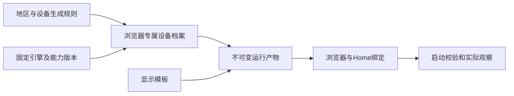

# 指纹能力评估与增强方案

状态：方案交付，尚未实施。关联[R6AY](work-items/R6AY-2026-10-03-fingerprint-capability-plan.md)、[1.0发行记录](releases/v1.0.md)与[当前架构](design.md)。

建议先建立可测的能力清单，再引入每个浏览器独立且可恢复的设备档案，随后完善跨层一致性和升级验收。当前独立Home已经隔离网站持久数据，但不能由此推断浏览器之间拥有独立设备指纹，也不能承诺网站无法关联它们。IP、账号登录、使用行为和浏览器本身的可观测特征都可能形成关联。

本方案不修改1.0程序、镜像、四个内置指纹模板、两个显示模板或24份组合报告；不重新随机化已有Home。本轮交付仅为评估和后续实施计划。

## 1. 当前实现与证据

| 范围 | 源码事实 | 已有证据与限制 |
| --- | --- | --- |
| 通用US/TW/JP/CN模板 | [template_sources.py](../infra/camoufox/template_sources.py)的通用源声明locale、languages、timezone；生成目标另选引擎/版本 | 四地区和两显示模式已完成[R6AW验收](../infra/sealskin/r6aw-builtins-acceptance-2026-10-03.md)。它们不是四类完整硬件设备清单 |
| Camoufox | [environment.py](../infra/camoufox/environment.py)保存完整Browserforge结果、resolvedConfig、偏好及种子，校验版本/文件摘要；组合生成缓存按模板与引擎目标冻结，显示组合复用非显示设备值 | 有冻结、重建和显示/存储观察。生成器输出及传参不能单独证明每个字段都被网页按预期观察到，也不证明符合真实人群分布 |
| Chromix | [native_jobs.py](../infra/camoufox/native_jobs.py)在模板/目标缓存生成一次seed并写入产物；[launcher.py](../infra/chromix/launcher.py)优先使用产物seed，Home中的独立seed只作回退 | 复用同一产物的多个Home可共享有效seed。当前自动/v3/v4启动路径传入canvas/audio种子、native GPU及固定8核/8GB/配额参数；不能把这些参数等同于全面防识别能力 |
| Firefox | [browser-platform.cfg](../infra/environment-engines/browser-platform.cfg)锁定语言、代理/DNS、WebRTC等；RFP、fingerprintingProtection及baselineFingerprintingProtection显式关闭 | 适合作为原生行为与网络隔离基线；不能宣称具有Camoufox相同的设备伪装面 |
| 显示 | [三引擎说明](../infra/environment-engines/README.md)区分固定1920×1080/DPR1与随客户端缩放变化的自动模式 | 已有实际显示/DPR/缩放验证。自动模式的viewport变化是允许行为，不能要求所有显示值跨客户端始终相同 |
| Home与恢复 | 生命周期绑定独立Home，保留原Session/操作归属；[R6AX](../infra/sealskin/r6ax-v1-install-acceptance-2026-10-03.md)已验证同Home输入、正常关闭、服务与整机重启恢复 | 证明限定范围的数据和运行恢复；不是浏览器间指纹不可关联证明 |
| 观察工具 | [acceptance.py](../infra/environment-engines/acceptance.py)、[probe.py](../infra/environment-engines/probe.py)、[Camoufox测试](../infra/camoufox/tests)与[动态客户端检查](../infra/environment-engines/check-dynamic-client.py)覆盖部分页面/显示/存储与两Home重建观察 | 现有报告不包含完整识别面覆盖率、总体碰撞率或长期网站识别统计；未观察的面保持未知 |

关键结论来自源码：当前“模板＋引擎目标”缓存拥有冻结设备值，多Home复用产物主要提供环境重放。独立Home不自动产生新的有效设备身份。共享seed也不等于所有网页观察必然完全相同：渲染器、运行状态和显示条件仍可能影响结果，须通过后续观察确认。

## 2. 先补齐能力与观察清单

下一阶段为每个字段记录：原生值/受控值/派生值/禁用/未支持、实际读取入口、数据来源、稳定性范围和适用引擎版本。每个结论同时关联声明值、真实浏览器观察、网络端观察及报告版本。

| 识别面 | 建议观察与一致性检查 |
| --- | --- |
| 浏览器/平台 | UA、可用的Client Hints、navigator平台及版本，与真实引擎、HTTP请求头和可用API相互对应；不以改一条UA宣称换了操作系统 |
| 语言/地区 | navigator.languages、HTTP Accept-Language、Intl locale/timezone、日期/DST；代理地区与模板地区的差异显式展示，不因代理自然漂移自动更换既有身份 |
| 显示 | screen/avail/inner/outer尺寸、DPR、media queries、字体度量和真实桌面；区分固定设备值、会话值及自动显示允许变化 |
| 渲染与字体 | Canvas、WebGL vendor/renderer/limits、扩展、字体集合与度量；支持时另测WebGPU。不同API声明同一硬件时不能互相矛盾 |
| 音频/媒体 | AudioContext输出、采样率、编解码能力、mediaDevices/权限、语音列表；禁用或空列表应记录实际兼容性影响 |
| 资源与存储 | hardwareConcurrency、deviceMemory（存在时）、storage estimate及配额、触摸/指针能力；避免模板参数之间矛盾，区分对外声明与容器真实资源预算 |
| 网络 | DNS/WebRTC及代理路径、服务端可见IP/请求头、原生TLS/HTTP特征；JS字段覆盖不能修改全部网络栈特征，现有失败关闭策略必须保留 |
| 时间与状态 | 同会话重复、正常关闭/重开、服务/主机重启、备份恢复、两个独立Home及版本升级前后差异；时序噪声单列，不当作稳定身份字段 |

测试页面应由项目控制并固定版本，可保存脱敏观察报告；网络端观察使用已授权QA端点。公开检测网站可作辅助对照，不能把某一站点的分数作为唯一验收。数据优先使用可审计的固定生成器、公开规格和授权设备对照；真实人群代表性、授权和版本来源未确认前，不宣称具有真实用户分布。

## 3. 建议引入每浏览器设备档案

以下是拟议设计，当前代码尚未实现。

模板保存规则和来源，不再让通用模板缓存充当所有浏览器共同的设备身份。浏览器目录绑定私有`device_profile_id`及不可变产物摘要；档案记录格式/生成器版本、引擎目标、设备字段和种子、约束版本、来源摘要及迁移关系。字段是设计示意，实施前须确定正式schema与存储归属。

设备档案由浏览器创建事务生成一次，使用原创建幂等键。重试、服务崩溃、重建容器、恢复Home和调整显示都不得重新抽样。并发创建、半成品写入与失败回收必须有可核对的事务记录；不把新档案错绑到已有Home，不通过共享全局随机状态生成身份。

Chromix优先解决有效seed的归属：每浏览器生成并冻结实际进入产物的seed，而不是只生成最终被覆盖的Home备用seed。Camoufox则按每浏览器设备档案生成并冻结整套相关字段，显示组合只派生允许变化的显示部分。Firefox先保持原生基线；若要扩大其受控面，须先评估引擎支持和兼容性，不默认复制另一引擎的配置即可生效。

独立seed不是独立可观测指纹的保证。硬件、字体、地区和版本值应从相互兼容的设备类别中成组选择；测试测量实际碰撞和跨API矛盾，不能要求每个字段都唯一。native GPU、同出口IP或同账号仍可能形成关联，不能用随机化掩盖这些边界。

**验收模型需要随新格式重新设计。** 当前accepted绑定精确产物、镜像和报告；直接改旧产物seed会破坏这一关系。新方案应区分已验证的生成规则/能力版本与具体设备产物，并规定每份派生产物的静态校验、首次启动观察和拒绝条件。实施时新增格式和独立验收，不继承旧24组合的PASS替代新模型证明。

## 4. 旧Home、升级与恢复

现有Home默认按legacy档案绑定原冻结值，不自动换seed、字体、硬件类别或语言。需要切换身份时作为明确的新建/迁移操作处理；不能借浏览器升级悄悄改变用户的网站身份。即使使用同一设备档案，浏览器大版本、字体和驱动变化也可能改变观察，不能承诺任意升级下所有输出不变。

升级候选在QA副本比较旧版与新版，先列出预期差异、兼容性规则及不可接受差异；生成新产物并保存迁移关系，原版本继续可核对。失败时保留原档案与Home。浏览器已升级写入的数据库未必能直接由旧引擎打开，回退须使用事先验证的兼容路径或同一时点备份，不能只换镜像。

设备档案属于恢复材料，应随Home绑定、原控制身份、配置、密钥和精确依赖进入一致性备份。私有标识和种子不进入网页可见的额外请求头、公开日志或URL。仍沿用既有权限、加密备份与恢复隔离规则；档案损坏/缺失/跨Home绑定时停止放行，不临时随机一个新身份继续启动。

## 5. 分阶段实施与完成门槛

以下全部待后续纳入执行范围；本方案不自动启动实现。

| 阶段 | 工作与相对成本 | 完成条件 |
| --- | --- | --- |
| F1 能力清单与基线 | 较低至中等；补观察面、固定页面/网络端报告与字段分类 | 三引擎逐字段有实现和观察证据，未支持/未测明确；同Home/两Home/重建差异可解释，形成后续验收基线 |
| F2 档案与身份归属 | 较高；目录/schema、生成器、缓存、幂等事务、启动和备份关联 | 新浏览器拥有一次生成的独立档案；重试/恢复保持，跨Home绑定拒绝；legacy值不变；新产物不能借用旧accepted记录 |
| F3 跨层一致性 | 较高，取决于引擎；设备类别、语言/头、字体/渲染/音频、资源与网络对照 | 预先列出的相互约束全部可测，冲突候选拒绝；用独立样本报告实际分布/碰撞及兼容性，不声称覆盖所有网站 |
| F4 升级和恢复门槛 | 中等至较高，长期持续；版本锁、差异报告、迁移/回退与操作说明 | 冷启动、正常关闭、服务/主机重启、独立恢复及升级差异全部通过；失败保留原档案/数据，发布材料可重放 |

F1先给出测量结果再确定F2/F3的具体设备类别、字段优先级和样本预算。初始工程样本可从每引擎50份独立档案起步，同时覆盖固定边界值；这是发现明显相关性/碰撞的工程样本，不是总体统计保证。任何碰撞阈值须在实验前按字段分类定义，不能看到结果后调整为通过。

维护成本主要来自引擎版本、字体/图形依赖、浏览器接口变化和供应商能力差异。优先减少少量可测的跨层矛盾，不追求堆叠无法验证的开关。需要引擎原生支持的字段先做能力试验；没有可靠支持时保留原生行为或明确不支持，不以页面注入伪装成全局能力。

## 6. 未来验收原则与当前边界

实现阶段至少分别验证：同档案稳定性、不同档案实际观察分布、显示允许变化、跨API/HTTP一致性、幂等创建/取消/损坏拒绝、原Home迁移、完整备份恢复及浏览器升级。持久数据与设备身份分别断言，不能让一类通过替代另一类。

测试仅用独立QA资源和明确的副本，保留失败、种子/产物的私有摘要及生成版本。生产维护另按具体工作项范围进行。当前商业供应商自然动态漂移无实测供应商，DEV-150异机首次IndexedDB时延仍保留；本方案没有新增运行实验，也没有补齐这些缺证。
